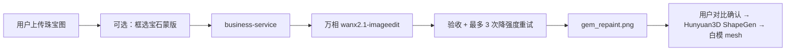
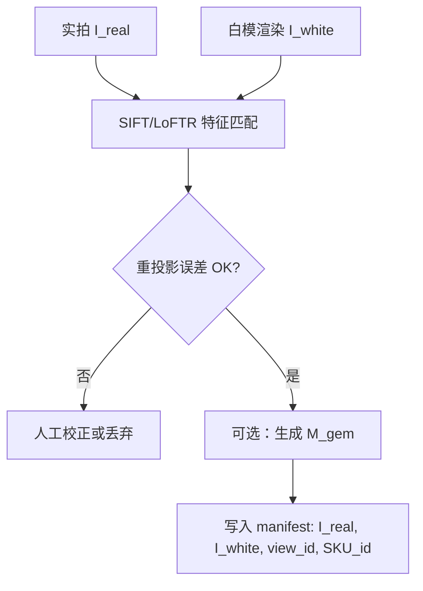
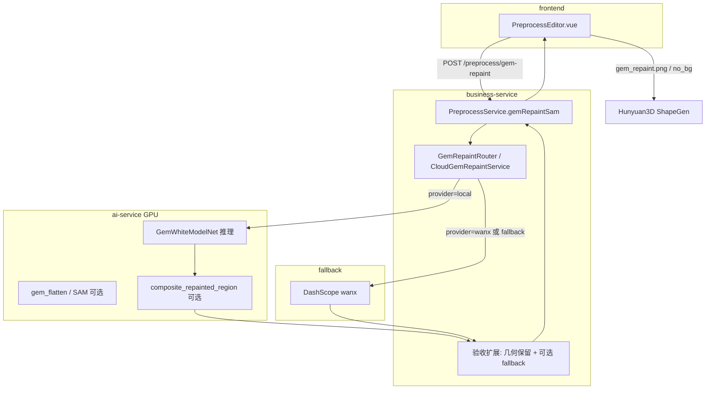
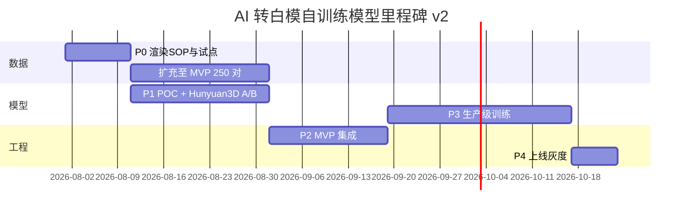

# AI 去反光自训练模型功能设计

> **日期**: 2026-07-29  
> **版本**: v2.0  
> **范围**: 以自训练小模型替代/补充当前通义万相（Wanx）云端「AI 去反光」能力  
> **主要源码参考**:
>
> - `frontend/src/components/PreprocessEditor.vue`（「AI 去反光」标签页）
> - `business-service/.../CloudGemRepaintService.java`
> - `business-service/.../DashScopeRepaintClient.java`
> - `business-service/.../WanxGemRepaintAcceptanceUtil.java`
> - `ai-service/app/services/preprocess/gem_repaint.py`（历史 Ip2p 路径，可复用合成逻辑）
> - `docs/gem-repaint-cloud-api-research.md`
> - `docs/轨道A开发指南.md`（轨道 A 默认纯几何、无纹理）

---

## 修订说明（v1 → v2）

| 维度 | v1（2026-07-29 初稿） | v2（本版） |
|------|----------------------|------------|
| **任务定义** | 镜面高光分离 / 保留宝石 diffuse 颜色与哑光外观 | **实拍反光图 → 白模风格几何渲染图**（image-to-image） |
| **监督目标** | 必须额外建设 matte 宝石 label（修图/哑光渲染/伪标签） | **同视角白模渲染图即 label**；`(I_real, I_white)` 二元组即可训练 |
| **输出期望** | 接近「哑光真实宝石照片」 | **接近训练集输出**（白模/几何渲染风格）；非照片级材质还原 |
| **下游诉求** | 隐含「保留材质供纹理/展示」 | **主流程仅需空间几何理解**（Hunyuan3D ShapeGen）；系统尚无材质相关功能（`TRACK_A_GEOMETRY_ONLY=true` 为默认） |
| **数据量** | POC 150 / MVP 500 / 生产 800–1500 对 | **显著降低**（见 §4.3） |
| **工期** | POC 6–8 周 / 生产 16–20 周 | **缩短**（见 §8） |

**保留的 v1 结论**：万相生成式编辑的局限、现有 PreprocessEditor → business → ai-service 集成架构、万相 fallback 策略、GPU 错峰加载模式——在 v2 下仍然有效。

**需验证的 v2 假设**：Hunyuan3D 对「白模风格预处理图」的 shape 重建是否优于「强反光实拍图」——应在 P1 POC 阶段用 A/B 对比实测，不可仅作理论推断（见 §7.3）。

---

## 1. 背景与动机

### 1.1 当前实现概览

| 层级 | 路径 | 职责 |
|------|------|------|
| 前端 | `PreprocessEditor.vue` | 框选/涂抹宝石蒙版 → 调用去反光 → 前后对比确认 |
| 业务 | `PreprocessService.gemRepaintSam()` | 落盘 session → 调用 `CloudGemRepaintService` |
| 云端 | `DashScopeRepaintClient` | 万相 `description_edit` / `description_edit_with_mask` |
| 验收 | `WanxGemRepaintAcceptanceUtil` | 检测主石是否被擦除、镜面高光是否加重 |
| 历史 | `ai-service/gem_repaint.py` | SAM 蒙版 + InstructPix2Pix 局部合成（已迁移至万相，代码保留） |

**当前端到端流程：**



### 1.2 万相方案的局限（为何结果「过于抽象」）

通义万相属于 **生成式图像编辑**（扩散/指令编辑），本质是在 prompt 约束下 **重新绘制** 目标区域，而非物理意义上的「去除镜面反射层」。在产品使用中表现为：

| 现象 | 根因 |
|------|------|
| 宝石切面被「抹平」、失去立体感 | 扩散模型倾向将整块区域 matte 化，高光与暗部对比被拉平，出现 banding |
| 颜色/透明度漂移，与实物不符 | 语义编辑无法精确保留 subsurface scattering、色散等宝石光学特性 |
| 主石被擦除、镂空或变「玻璃球」 | 生成模型对「去反光」理解成「重画材质」，易误删实体（已有 `WanxGemRepaintAcceptanceUtil` 拦截） |
| 金属爪镶/戒圈色调渗透 | 即使蒙版局部编辑，边缘扩散仍可能改变相邻金属区域 |
| 多视图风格不一致 | 同一 SKU 不同角度每次调用结果随机，影响后续 Hunyuan3D 多视图 shape 一致性 |
| 延迟与成本 | 异步 API ~15–45s/张，按张计费；依赖外网与 API Key |

**与 Ip2p 历史问题的对比**（见 `docs/gem-repaint-cloud-api-research.md` §1.2）：万相在语义理解上更强，但仍属于 **生成式重绘**，无法保证「只去掉 specular、保留 diffuse albedo」这一物理目标。用户感知的「过于抽象」，本质是 **编辑任务被当作生成任务**，缺少领域专用的几何导向转换能力。

> **v2 视角**：对当前主流程而言，「保留 diffuse 颜色」并非硬性需求；更关键的是 **消除强反光对 Hunyuan3D 轮廓/切面理解的干扰**，输出可接受为 **白模风格几何图** 而非照片级哑光宝石。

### 1.3 自训练模型的动机

- **任务专一化**：针对「实拍反光图 → 白模风格几何渲染图」训练专用网络，避免通用扩散模型的语义漂移与随机性。
- **可控与可复现**：固定权重推理，同图多次结果一致（或仅依赖可选 seed）；多视图 SKU 输出风格一致。
- **本地 GPU 推理**：与 Hunyuan3D 错峰加载（复用现有 `RepaintModelManager` 错峰模式），降低外网依赖与按张成本。
- **数据闭环简化**：业务已积累或可批量渲染的 **「实拍图 + 同视角白模渲染」** 配对，可直接构成监督数据，无需额外 matte label 管线。
- **与主流程对齐**：轨道 A 默认 `TRACK_A_GEOMETRY_ONLY=true`，ShapeGen 输出无纹理白模；预处理阶段产出白模风格图与下游诉求一致。

---

## 2. 目标与范围

### 2.1 功能目标

| 项目 | 说明 |
|------|------|
| **输入** | 珠宝图像（jpg / png / bmp），含镜面反光的主石/金属区域 |
| **可选输入** | 用户绘制或自动分割的宝石蒙版；同 SKU 多视角白模渲染（训练期条件；推理期可仅单图） |
| **输出** | **白模风格 / 几何保持渲染图**（与训练集 target 一致：灰模、法线着色或统一 Lambert 白模渲染），**非** matte 真实宝石照片 |
| **集成** | 替换或优先于万相，接入现有 `PreprocessEditor` → `/preprocess/gem-repaint` 链路 |
| **回退** | 保留万相作为 fallback（`GEM_REPAINT_FALLBACK_ENABLED=true`） |

### 2.2 非目标（本期不做）

- **不追求** 照片级材质还原、宝石颜色保真、subsurface scattering 保留
- 不修复抠图质量、不改变宝石颜色品类（如红宝石变蓝宝石）
- 不处理视频、360° 转盘序列的时序一致性（可作为后续扩展）
- 不替代 SAM/HSV 分割逻辑（继续复用现有蒙版工作流，用于局部 loss 加权或合成）
- 不训练通用「任意物体去反光」模型（范围限定珠宝 SKU）
- **不** 为尚未上线的纹理/PBR 管线提前优化「哑光真实感」

### 2.3 何时 v2 输出足够 / 不足

| 场景 | v2 白模风格输出 | 说明 |
|------|----------------|------|
| 轨道 A ShapeGen 单图/多视图建模 | ✅ **足够** | 主流程仅需轮廓、切面、体积感；默认无纹理 |
| 多视图 shape 一致性 | ✅ **优于万相** | 固定权重 + 渲染风格 target → 跨视角更稳定 |
| 用户预览「去反光前后」对比 | △ **需管理预期** | 输出非照片级；UI 应说明「转几何图/白模风格」 |
| 未来启用 Hunyuan3D-Paint 纹理 | ⚠️ **可能不足** | 白模图丢失 albedo；届时需 v3 或分支管线 |
| 电商主图直接替换 | ❌ **不适用** | 非本功能目标 |

---

## 3. 问题定义与技术路线对比

### 3.1 任务本质（v2 重定义）

v2 将预处理任务从 **specular highlight removal** 调整为 **photo-to-white-model-style image translation**：

```
I_real（实拍反光图）  →  I_white（同视角白模/几何渲染风格图）
```

| 维度 | v1 理解 | v2 理解 |
|------|---------|---------|
| 核心目标 | 抑制镜面高光，保留 diffuse 颜色 | **提取/对齐几何结构**，输出与 CAD 白模渲染一致的 2D 表征 |
| 监督信号 | 需 matte 目标图 | **白模渲染图即 ground truth** |
| 与 Hunyuan3D 关系 | 间接改善纹理 | **直接服务 ShapeGen 的空间理解**；输入越接近训练分布（白模风格），越利于 shape 重建 |
| 物理意义 | intrinsic decomposition 子问题 | **2D 几何代理生成**（domain transfer: photo → render） |

**保留的约束**（仍重要）：

- **几何一致**：切面走向、主石轮廓、爪镶位置应与原图对齐
- **非 gem 区尽量不变**（若采用整图模型）或 **蒙版内转换 + 蒙版外恒等**（若采用局部合成）
- **多视图一致**：同一 SKU 各视角输出应共享同一「渲染风格」

### 3.2 「白模」在 v2 中的角色（重要）

项目中「白模」有两类含义；v2 下二者关系更清晰：

| 含义 | 来源 | v2 角色 |
|------|------|---------|
| **3D 几何白模** | Hunyuan3D / 轨道 A 生成的无纹理 mesh | **下游最终产物**；预处理输出应与之在「几何可读性」上同向 |
| **同视角 2D 白模渲染图** | CAD/3D 资产按实拍相机位姿离线渲染（灰模/Lambert/法线着色） | **训练 target（label）**；亦可同时作 **条件输入（condition）** |

**v2 结论（相对 v1 的 pivot）**：

> **「实拍图 + 同视角白模渲染」配对，足以完成有监督训练。**  
> 不再需要单独的 matte 宝石 label 或三元组 `(I_real, C_geo, I_matte)`。  
> 推荐最小形态为 **二元组** `(I_real, I_white)`；增强形态为 `(I_real, I_white, M_gem)` 或 `(I_real, I_white, view_id)`。

**白模可同时承担 condition + target 的简化方案**：

- **训练**：输入 `I_real`（+ 可选 `M_gem`），target = `I_white`；若已有对齐白模，可将 `I_white` 浅层拼接到 encoder 作为几何 hint（teacher forcing），推理时无白模也可单图运行
- **多视图**：同一 SKU 的 `{front, left, right, ...}` 白模渲染提供 **跨视角几何一致性** 监督；模型可学习 view-invariant 的 photo→render 映射

### 3.3 技术路线对比

| 路线 | 思路 | 优点 | 缺点 | 推荐度 |
|------|------|------|------|--------|
| **A. 条件 U-Net / Pix2Pix** | 输入 RGB（+ mask），输出整图或 gem 区白模风格图 | 轻量（5–30M）、推理快（<1s）、paired 训练成熟 | 需视角/尺度对齐；photo-render gap | ⭐⭐⭐ **首选 MVP** |
| **B. CycleGAN** | 无严格配对时的 domain transfer | 可缓解 pairing 不足 | 几何易漂移、色偏；珠宝结构细节难保 | ⭐ |
| **C. 小扩散 img2img（LCM/Turbo LoRA）** | 以 `I_white` 为 target 微调轻量扩散 | 视觉平滑、domain gap 较小 | 推理慢于 U-Net；与 Hunyuan3D 争 GPU | ⭐⭐ 备选 / 二期 |
| **D. ControlNet-lite** | 以白模渲染（深度/法线）为条件，U-Net 解码 | 几何控制强 | 训练期需渲染多种 buffer；推理可无 condition | ⭐⭐ 有多视图 CAD 时 |
| **E. Retinex + 学习 refinement** | 经典高光抑制 + CNN 后处理到 render 风格 | 可解释、冷启动快 | 单独 Retinex 无法产出白模风格，仅作 pre/post | ⭐⭐ baseline |
| **F. 物理渲染反演** | 估计法向 + 环境光分离 specular | 理论完备 | 单图 ill-posed；v2 目标已非物理分解 | ⭐ 不推荐 |

**推荐组合**：

1. **MVP**：`A`（Pix2Pix 式 U-Net 或 conditional U-Net）+ 现有 `composite_repainted_region` 蒙版合成（若仅转换 gem 区）  
2. **增强**：多视图共享 backbone + `view_id` embedding；或 `D` 用法线/深度作额外 condition  
3. **Fallback**：万相（当前 `CloudGemRepaintService`）

### 3.4 多视图策略

| 方案 | 说明 | 适用 |
|------|------|------|
| **单模型 + view embedding** | 输入 `(I_real, view_id)`，target `I_white` | SKU 多视角套图充足 |
| **单模型无 view 条件** | 仅靠图像内容泛化 | 视角差异小、数据多样 |
| **每 SKU 共享 latent / 风格码** | 推理时对同 SKU 多图施加一致 style | 多视图同时预处理 |
| **逐张独立推理** | 最简单 | MVP 默认；依赖 target 渲染风格一致保证输出一致 |

多视图白模渲染的价值：**训练** 提供 cross-view 几何约束；**推理输出** 可直接作为 Hunyuan3D-2mv 的多视图输入，风格统一优于万相随机重绘。

---

## 4. 数据方案

### 4.1 素材类型（v2 简化）

| 类型 | 说明 | 用途 |
|------|------|------|
| **I_real** | 棚拍/电商珠宝实拍，含明显 gem/metal specular | **输入** |
| **I_white** | 同 SKU **同视角** 3D 白模渲染（灰模 / 统一灰 Lambert / 法线 false-color 均可，全 pipeline 固定一种） | **监督 target（label）** |
| **M_gem** | 主石区域二值蒙版（SAM/人工/渲染 ID buffer） | 训练 loss 加权 + 推理局部合成（可选） |
| **view_id** | front / left / right / back 等 | 多视图条件（可选） |
| **SKU_id** | 款式标识 | 划分 train/val；多视图分组 |

**v2 不再必需**：`I_matte`（哑光宝石照片）、人工修图金标准（除 small val set 外）、万相伪标签。

### 4.2 配对与对齐要求

| 维度 | 要求 | 验收方式 |
|------|------|----------|
| **相机位姿** | 实拍与 `I_white` 视角偏差 ≤ 2–3°，或 reprojection error < 3 px | 特征点匹配 + 单应/PNP |
| **尺度** | 主体占画幅比例一致（±5%） | bbox IoU |
| **焦距** | 同 SKU 套图固定焦段或 EXIF 记录 | 元数据校验 |
| **光照** | 实拍与渲染 **不要求** 光照一致；模型学 photo→render | 目视 + SSIM on structure |
| **渲染风格** | 全数据集 **统一** 白模 BSDF（建议 neutral gray Lambert + 可选 rim light） | 渲染 SOP 文档 |
| **蒙版** | 若用局部 loss：`M_gem` 与 I_real 同分辨率 | 与现有 `gem_mask.png` 一致 |

**对齐流程建议**：



### 4.3 数据量估算（v2 下调）

任务简化为 paired translation 后，label 可批量渲染，数据瓶颈从「 matte 标注」转为 **对齐质量 + SKU/视角覆盖**：

假设覆盖 **5 种主石** × **3–5 种戒款** × **每 SKU 4–6 视角**：

| 阶段 | 配对样本量 | 预期效果 | 说明 |
|------|-----------|----------|------|
| **Feasibility POC** | **50–80 对** | loss 收敛；定性可见 photo→白模风格 | 1–2 款 × 多视角；验证 Hunyuan3D A/B |
| **MVP 内测** | **150–300 对** | 主流程可用；常见款 acceptable | 3+ 款、2+ 石种、含侧光/强反光 |
| **生产可用** | **400–700 对** | 端到端 shape 可接受率 ≥ 80% | 覆盖复杂切面、爪镶、弱反光 no-op |
| **持续迭代** | +100 对/季度 | 减少 long-tail failure | 线上 bad case + 新 SKU 渲染 |

> **对比 v1**：生产目标从 800–1500 **降至 400–700**；POC 从 80–150 **降至 50–80**。  
> **多视图折算**：1 SKU × 5 视角 = 5 对独立样本，但仅计 1 SKU 覆盖；宜按 **SKU 数 + 总对数** 双指标管理。

### 4.4 数据来源与合成策略

#### 4.4.1 真实实拍 + CAD 白模渲染（推荐主路径）

1. 棚拍 `I_real`（现有摄影流程）
2. 由同款 CAD/3D 资产，按对齐相机参数批量渲染 `I_white`
3. 优点：label 无限扩展、一致性强；缺点：**photo-render domain gap**

#### 4.4.2 纯合成数据（冷启动 / 扩增）

1. 从 CAD 渲染 **带 fake specular** 的「伪实拍」（叠加环境贴图高光、棚拍 LUT）
2. Pair：`(I_fake_photo, I_white)` 同帧生成，**零对齐误差**
3. 用于预训练或占训练集 30–50%；**必须用真实 `I_real` finetune**，否则 POC 后 Hunyuan3D 指标可能虚高

#### 4.4.3 Domain gap 讨论

| gap 类型 | 表现 | 缓解 |
|----------|------|------|
| **photo → render 风格** | 输出「太 CG」或残留实拍纹理 | 混合真实 finetune；target 风格统一 |
| **金属高光** | 爪镶过亮导致 shape 歧义 | 训练集含金属；loss 全图或 weighted |
| **无 CAD 的 SKU** | 无法生成 `I_white` | 仅用合成预训练 + 少量手工对齐；或 fallback 万相 |
| **钻石/无色宝石** | 反光与金属混淆 | 单独子集；精确 `M_gem` |

**v2 不再推荐**（除非未来 v3）： matte 人工修图作为主 label、万相伪标签作为主监督。

### 4.5 采集与标注流程

| 步骤 | 负责 | 产出 |
|------|------|------|
| 1. 棚拍套图 | 摄影/运营 | `I_real` |
| 2. 相机位姿估计 / 元数据 | 数据工程 | 外参/近似角度 JSON |
| 3. 同位姿白模渲染 | 3D/CAD | `I_white`（多视角） |
| 4. 对齐质检 | 数据工程 | 对齐报告；不合格丢弃 |
| 5. gem mask（可选） | SAM 预标 + 人工修 | `M_gem` |
| 6. 验收入库 | ML | `manifest.csv` |

**标注工具**：复用 `PreprocessEditor` 蒙版交互；质检页可简化为「对齐 OK / 渲染风格 OK」。

---

## 5. 模型方案

### 5.1 推荐架构（MVP）

**GemWhiteModelNet**（工作名）：轻量 conditional U-Net / Pix2Pix generator

```
Input:  [B, 3~4, H, W] = RGB (I_real) [+ gem mask (M_gem)]
        可选 [B, 3, H, W] = I_white 作为 condition（训练期 teacher forcing；推理可省略）
Output: [B, 3, H, W] = I_white_pred（白模风格渲染图）
Loss:   L1 + perceptual (VGG) [全图或 mask 加权]
        + optional identity on (1 - mask) 若局部合成
        + optional multi-view consistency（同 SKU 不同 view 的 feature 距离）
```

| 参数 | 建议值 |
|------|--------|
| 参数量 | 8–25M（生成器）；Pix2Pix 判别器 +5–15M |
| 输入分辨率 | 512×512（与万相一致，便于对比） |
| 推理步数 | 1（单次前向） |
| 显存 | ~1–2 GB FP16 |

**与 v1 GemSpecularNet 差异**：输出空间是 **render 域** 而非「修正后的 gem RGB」；loss 不再强调 color consistency / specular penalty，改为 **与 I_white 的结构/感知对齐**。

### 5.2 训练策略

| 项目 | 方案 |
|------|------|
| 预训练 | 合成 `(I_fake_photo, I_white)` 50k–200k 对（可选） |
| 主训练 | paired `(I_real, I_white)`，80–150 epochs，early stop on val |
| 微调 | 真实数据 hold-out SKU；小 lr 10–20 epochs |
| 数据增强 | 随机亮度/对比度、jpeg、轻微平移（±5px，同步 pair） |
| 弱反光 / 已接近白模 | 加入 **no-op** 样本（`I_real ≈ I_white` 或低权重）防过度转换 |
| 负样本 | 无珠宝图 → 输出 ≈ 输入（防 artifacts） |

### 5.3 评估指标（v2 调整）

| 指标 | 定义 | MVP 目标 |
|------|------|----------|
| **SSIM / LPIPS vs I_white** | 与 target 渲染的结构/感知相似 | SSIM ≥ 0.70；LPIPS ≤ 0.30 |
| **Edge IoU** | Canny 边缘与 `I_white` 重叠 | ≥ 0.65 |
| **Gem/主体 Retention** | 主石区域非空、无大面积塌陷 | ≥ 90% |
| **Multi-view Style Std** | 同 SKU 各视角输出均值方差 | 低于万相 baseline |
| **Hunyuan3D Shape Proxy** | 用预处理图 vs 原图分别跑 ShapeGen，比较 mesh Chamfer / 人工 shape 评分 | POC **必做**；MVP 优于原图 baseline |
| **Metal/prong sharpness** | 爪镶细结构目视 + 高频能量 | 无显著糊化 |
| **非 gem 区 PSNR**（若局部合成） | 蒙版外不变 | ≥ 38 dB |
| **人工 Accept Rate** | 「可用于 3D 生成」盲评 | MVP ≥ 75%，生产 ≥ 85% |

**弱化或移除的 v1 指标**：Specular Ratio 下降、ΔE_color（对 gem diffuse）——v2 不追求哑光照片色准。

---

## 6. 系统集成设计

### 6.1 目标架构



### 6.2 配置扩展

在现有 `GemRepaintProperties` 基础上扩展：

```yaml
gem:
  repaint:
    provider: local          # local | wanx
    fallback-enabled: true   # local 失败 → wanx
    local:
      model-path: ./models/gem-white-model-net
      device: cuda
      input-size: 512
      output-mode: white-render   # v2: 白模风格；非 matte-photo
      use-mask-composite: true    # 是否仅替换 gem 区
    # 现有 wanx / dashscope 配置保持不变
```

环境变量（ai-service）：

```
ENABLE_GEM_REPAINT=1
GEM_REPAINT_MODEL_PATH=./models/gem-white-model-net
GEM_REPAINT_PROVIDER=local
```

### 6.3 API 变更（最小侵入）

**现有接口保持不变**：`POST /preprocess/gem-repaint`

| 字段 | 变更 |
|------|------|
| `image` | 不变 |
| `mask` | local 模式可选（整图转换时可自动分割或省略） |
| `strength` | local 模式下映射为 `blend_alpha`（0=原图, 1=全白模风格） |
| `prompt` | local 模式忽略 |
| 响应 `repaintMethod` | 新增 `local_white_model` / `local_white_model_fallback_wanx` |

**ai-service 新增/恢复**：

- `POST /api/preprocess/gem-repaint-local` — 接收 image（+ 可选 mask），返回 PNG  
- 复用 `repaint_model_manager.py`：lazy load / unload，与 Hunyuan3D 错峰  

**business-service 路由逻辑**（同 v1）：

```java
if ("local".equals(properties.getProvider())) {
    try {
        return aiServiceClient.callGemRepaintLocal(...);
    } catch (Exception e) {
        if (properties.isFallbackEnabled()) {
            return cloudGemRepaintService.repaintWithMask(...);
        }
        throw e;
    }
}
```

### 6.4 前端改动

| 项 | 说明 |
|----|------|
| **UI 文案** | 建议：**「转白模 / 几何图（本地）」** 或保留 tab 名「AI 去反光」但在 tooltip 说明 *输出为白模风格渲染图，用于 3D 建模，非照片修图* |
| 强度滑条 | 保留；语义改为「白模风格强度」或「几何转换强度」 |
| 对比预览 | 不变；用户需理解 after 图为 render 风格 |
| 可选 | 多视图批量预处理入口（与 HomeView 多视图 workflow 联动，二期） |

### 6.5 与 3D 流水线的关系

- 预处理产物仍为 `gem_repaint.png` / `no_bg.png`，后续 Hunyuan3D ShapeGen **无接口变更**。
- 轨道 A 默认 **纯几何**（`TRACK_A_GEOMETRY_ONLY=true`）：ShapeGen 不依赖输入图的真实 albedo；**白模风格输入与下游白模 mesh 目标一致**。
- **多视图**：各视角 `gem_repaint.png` 可直接填入 `image-to-3d` 的 `views` 字典；v2 模型应保证 cross-view 渲染风格一致，优于万相。
- **待验证**：强反光原图 vs 白模风格预处理图 的 ShapeGen Chamfer/人工评分——POC 必须完成（§5.3）。

---

## 7. 可行性、难度与风险

### 7.1 可行性结论

| 维度 | v1 评估 | v2 评估 |
|------|---------|---------|
| **技术可行性** | 中等偏高（specular removal 难） | **偏高**（paired img2img 成熟；target 可渲染） |
| **数据可行性** | 关键瓶颈（缺 matte label） | **明显改善**；瓶颈转为对齐 + CAD 覆盖 |
| **集成可行性** | 高 | **高**（同 v1） |
| **GPU 可行性** | 高 | **高**（小 U-Net；训练量略降） |
| **产品匹配度** | 中（输出与几何流水线诉求部分错位） | **高**（与轨道 A 几何优先一致） |

### 7.2 难度分级

| 模块 | 难度 | 说明 |
|------|------|------|
| 渲染 SOP + 白模 target 批量产出 | ★★ | v2 核心数据工作；无修图 |
| 实拍-渲染对齐 | ★★★ | 与 v1 相同 |
| 模型训练调参 | ★★ | Pix2Pix/U-Net 标准流程 |
| Hunyuan3D A/B 验证 | ★★ | POC 必做；可能推翻假设 |
| ai-service 推理集成 | ★★ | 复用 Ip2p 路径 |
| business 路由 + fallback | ★★ | 配置驱动 |
| 前端文案与预期管理 | ★★ | 避免用户误以为照片修图 |

### 7.3 风险矩阵（v2）

| 风险 | 影响 | 缓解 |
|------|------|------|
| **Hunyuan3D 对白模输入无显著增益** | v2 立项价值受质疑 | POC 必做 A/B；若无增益则回退「仅去高光」或保留万相 |
| **白模与实拍几何未对齐** | shape 扭曲、切面错位 | 严格对齐 QC；丢弃 >3px 样本 |
| **爪镶/细金属过平滑** | 镶口细节丢失 | 边缘加权 loss；高分辨率 finetune patch |
| **photo-render domain gap** | 输出半实拍半渲染 | 合成预训练 + 真实 finetune；统一 target 风格 |
| **用户预期错位** | 投诉「不像去反光」 | UI 明确「转白模/几何图」；对比说明 |
| **无 CAD SKU** | 无法造 pair | fallback 万相或跳过本地模型 |
| **未来纹理管线** | 白模图无 albedo | 文档标注 v2 边界；预留 v3 分支 |
| **GPU 与 Hunyuan3D 争用** | OOM / 延迟 | lazy load（现有模式） |
| **long-tail 款型** | 线上失败 | fallback 万相 + bad case 回流 |

**v2 已消除的主要风险**：「仅有白模、无 matte label 无法监督训练」——不再成立。

---

## 8. 工期与里程碑

**团队假设**：1 名 ML 工程师（50%+ 投入）+ 现有后端/前端（各 10–20% 集成）+ 3D/渲染（阶段性 20%）

| 阶段 | 周期 | 交付物 | 退出标准 |
|------|------|--------|----------|
| **P0 数据规范 + 渲染 SOP** | **1–1.5 周** | 白模渲染脚本、manifest、**40 对**试点 | 对齐误差 < 3px ≥ 35 对 |
| **P1 POC** | **2–3 周** | U-Net/Pix2Pix + **Hunyuan3D A/B** | SSIM vs I_white ≥ 0.65；shape 人工评分 ≥ 原图 |
| **P2 MVP 集成** | **2–3 周** | ai-service + business 路由 + fallback | 端到端 < 5s/张；accept ≥ 75% |
| **P3 生产打磨** | **3–4 周** | 400+ 对、多 SKU、验收自动化 | accept ≥ 85%；multi-view 风格 std 优于万相 |
| **P4 上线** | **1 周** | 文档、灰度、监控 | 生产稳定 1 周 |

**总工期估算（v2）**：

| 目标 | v1 | **v2** |
|------|-----|--------|
| **POC 验证** | 6–8 周 | **4–5 周** |
| **MVP 可内测** | 10–12 周 | **7–9 周** |
| **生产可用** | 16–20 周 | **11–14 周**（约 3–3.5 个月） |



---

## 9. 资源需求

### 9.1 人力

| 角色 | 投入 | 职责 |
|------|------|------|
| ML 工程师 | 0.5 FTE × **3 月** | 模型、训练、Hunyuan3D A/B、推理部署 |
| 后端 | 0.1 FTE × 3 周 | provider 路由、验收扩展 |
| 前端 | 0.05 FTE | 文案、预期说明 |
| 3D/渲染 | 0.15 FTE × **1.5 月** | 白模批量渲染、相机对齐（**无 matte/修图**） |
| QA | 0.1 FTE | 盲评、shape 回归 |

### 9.2 算力

| 用途 | 规格 | 时长 |
|------|------|------|
| 训练 | 1× RTX 4090 / A10 24GB | POC ~25 GPU·h；生产 ~120 GPU·h |
| 推理 | 与 ai-service 同 GPU | 单次 ~0.2–0.8s @512² |
| 渲染 farm | CPU/GPU 均可 | 500 对 I_white ~**1–2 天**（较 v1 matte 大幅缩短） |

### 9.3 存储

| 项 | 估算 |
|----|------|
| 原始+渲染 pair | 500 对 × 4 MB ≈ 2 GB |
| 模型权重 | < 100 MB |
| 实验 artifact | ~8 GB |

---

## 10. 验收标准

### 10.1 功能验收

- [ ] `PreprocessEditor` 预处理 tab 可调用本地模型并完成前后对比
- [ ] 支持 jpg / png / bmp 输入，输出 png
- [ ] 输出视觉风格与训练 target（白模渲染）一致，UI 已说明非照片修图
- [ ] local 失败时自动 fallback 万相（可配置关闭）
- [ ] 与现有 `sessionId` / `gem_repaint.png` 落盘逻辑兼容

### 10.2 质量验收

| 指标 | MVP | 生产 |
|------|-----|------|
| 人工 Accept Rate（100 张盲评，「可用于 3D 生成」） | ≥ 75% | ≥ 85% |
| SSIM vs I_white（hold-out） | ≥ 0.70 | ≥ 0.75 |
| Hunyuan3D shape 人工评分 vs 原图 baseline | 优 | 显著优 |
| 多视图风格一致性（同 SKU std） | 低于万相 | 明显低于万相 |
| 主体/主石 retention | ≥ 88% | ≥ 92% |
| 爪镶严重糊化率 | < 8% | < 5% |
| P95 推理延迟（含合成） | < 5 s | < 3 s |

### 10.3 回归验收

- [ ] 抠图 → 预处理 → 3D 生成 端到端无回归
- [ ] `ENABLE_GEM_REPAINT=0` 时行为与现网一致
- [ ] GPU 错峰：Hunyuan3D 加载后本地预处理请求正常排队/卸载
- [ ] POC 报告含 **原图 vs 白模预处理图** ShapeGen 对比结论

---

## 11. 推荐决策

| 问题 | 建议 |
|------|------|
| 是否值得做？ | **值得**；v2 降低数据与工期门槛，且与轨道 A 几何流水线对齐 |
| 白模够吗？ | **够作 label**；`(I_real, I_white)` 即可；可选同时作 condition |
| 首版架构？ | **conditional U-Net / Pix2Pix** + 万相 fallback |
| 最小数据？ | POC **60 对**；MVP **200 对**（约 40 SKU×5 视角或等价覆盖） |
| 输出是照片吗？ | **否**；白模/几何渲染风格；用户与 QA 需按此预期验收 |
| 能否替代万相？ | MVP 后 **主路径本地 + 万相兜底**；完全去掉万相需 shape A/B 与 accept 达标 |
| 最大不确定性？ | **Hunyuan3D 是否真受益于白模输入**——POC 第一周启动 A/B |

---

## 12. 相关文档与代码

| 文档/模块 | 说明 |
|-----------|------|
| `docs/gem-repaint-cloud-api-research.md` | 万相选型与 Ip2p 废弃背景 |
| `docs/轨道A开发指南.md` | 纯几何默认、ShapeGen 与多视图 |
| `docs/对齐算法执行流程概览.md` | 文档风格参考 |
| `business-service/.../CloudGemRepaintService.java` | 当前云端去反光编排 |
| `ai-service/.../gem_repaint.py` | 蒙版合成逻辑（可复用） |
| `ai-service/.../repaint_model_manager.py` | GPU 错峰加载参考 |
| `ai-service/.../generator.py` | Hunyuan3D ShapeGen / 多视图入口 |

---

*文档版本: v2.0 | 2026-07-29 | 自 v1.0 pivot：matte 材质保留 → 白模风格 image-to-image*
