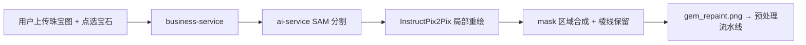
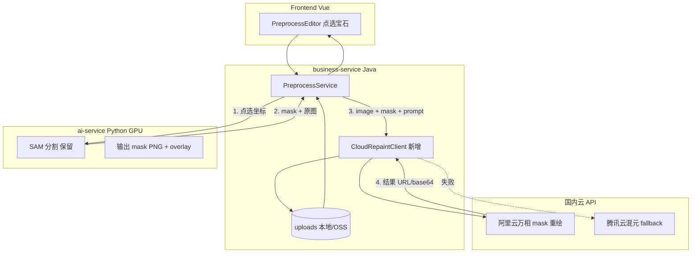
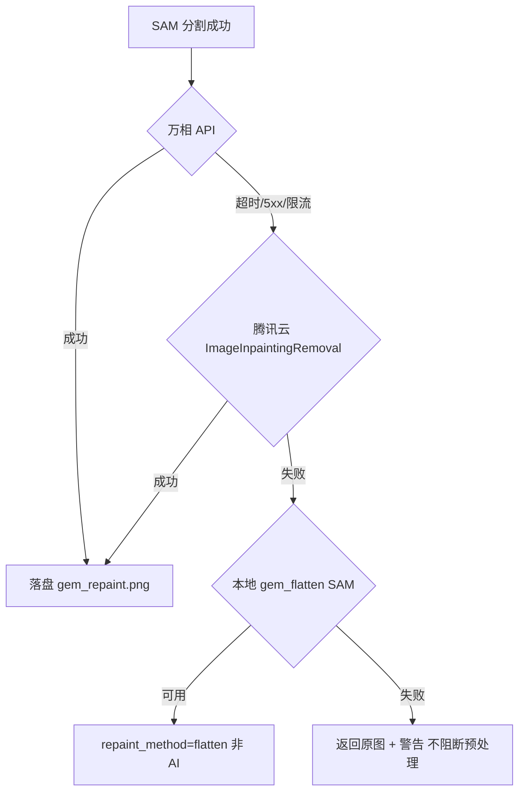

# 宝石去反光：云端图像重绘 API 选型调研

**日期**: 2026-07-28  
**范围**: 替换本地 InstructPix2Pix（Ip2p）+ SAM 蒙版的「AI 去反光」能力  
**问题**: 本地 Ip2p 在宝石/戒圈区域产生 harsh contrast、伪影；需改用国内付费生成式图像编辑 API  
**当前栈**: `ai-service`（Python，SAM + Ip2p）、`business-service`（Java）、`frontend`（Vue 预处理流水线）

---

## 1. 背景与现状

### 1.1 当前实现

| 层级 | 路径 | 职责 |
|------|------|------|
| 前端 | `frontend/src/components/PreprocessEditor.vue` | 用户点选宝石 → 调用去反光 |
| 业务 | `business-service/.../PreprocessService.java` | `callGemRepaintSam()` → ai-service |
| AI | `ai-service/app/routers/preprocess.py` → `/gem-repaint` | SAM 分割 + Ip2p 局部重绘 |
| 核心逻辑 | `ai-service/app/services/preprocess/gem_repaint.py` | SAM mask + InstructPix2Pix 合成 |
| 模型管理 | `ai-service/app/services/repaint_model_manager.py` | lazy load Ip2p，与 Hunyuan3D 错峰占 GPU |
| 配置 | `.env` → `ENABLE_GEM_REPAINT=1` 等 | 见 §6 废弃说明 |

**流程**:



### 1.2 已知问题（Ip2p）

- **对比度过强**：扩散模型倾向「matte 化」整块区域，宝石高光与暗部被拉平，出现不自然 banding。
- **金属/戒圈渗透**：即使 SAM mask + dilate + edge preserve，Ip2p 仍常改变爪镶、戒圈边缘色调。
- **多视图不一致**：同一 `seed` 在不同角度仍可能风格漂移，影响后续 3D 纹理一致性。
- **GPU 资源竞争**：Ip2p 与 Hunyuan3D 共用 GPU，增加排队与 OOM 风险。
- **模型体量**：`instruct-pix2pix` 需额外下载与维护，质量仍不满足产品图标准。

### 1.3 目标能力

| 需求 | 说明 |
|------|------|
| **Mask 驱动局部编辑** | 保留现有 SAM 点选分割，将 mask 传给云端 API |
| **语义可控** | 支持 prompt：「去除宝石镜面反光，保持颜色与切面，不改变金属爪镶」 |
| **产品图质量** | 适合电商珠宝白底/棚拍图，非艺术风格化 |
| **国内合规** | 数据不出境、可签企业协议、可开发票 |
| **可集成** | REST 或 Java/Python SDK，异步任务 + 超时重试 |
| **成本可控** | 按张计费，单次预处理 1 张，多视图 N 张 |

---

## 2. 国内厂商横向对比

> 调研时间 2026-07；价格以各平台官网为准，上线前需再次核验。

### 2.1 总览矩阵

| 厂商/产品 | API 可用性 | Mask/局部编辑 | 指令 Prompt | 电商场景 | 参考单价 | 延迟/限流 | 国内合规 | 珠宝去反光适配 |
|-----------|-----------|--------------|------------|---------|---------|----------|---------|--------------|
| **阿里云百炼 · 通义万相** | REST + DashScope SDK | ✅ `description_edit_with_mask` + wan2.7 `bbox_list` | ✅ | ✅ 官方电商修图场景 | wanx2.1: **0.14元/张**；wan2.7 见官网 | 异步；wanx2.1 RPS=2 | ✅ 阿里云 | ⭐⭐⭐ **首选** |
| **腾讯云 · 混元生图** | REST + Java/Go SDK | ✅ `ImageInpaintingRemoval`（mask 白=编辑） | ❌ 无 prompt | △ 偏消除/补全 | **限时免费** | 默认 **1 并发** | ✅ 腾讯云 | ⭐⭐ 备选（无 prompt） |
| **火山方舟 · SeedEdit 3.0** | REST（OpenAI 兼容） | ❌ 不支持 mask 参数 | ✅ 自然语言编辑 | △ 人像/背景强 | **~$0.03/张**（~0.22元） | 500 张/分钟 | ✅ 字节/火山 | ⭐ 精度风险 |
| **百度 · 图像修复** | REST | △ 仅 **矩形** `rectangle` | ❌ | △ 去遮挡物 | ~**0.43元/千次** | 10 QPS | ✅ 百度云 | ❌ 非生成式 |
| **百度 · 文心一格** | REST | ❌ 文生图为主 | △ | △ 海报/创意 | 按次包 | — | ✅ | ❌ 无 inpainting |
| **智谱 · CogView-4** | REST + SDK | ❌ 仅文生图 | ❌ | △ | ~0.06元/张 | — | ✅ | ❌ |
| **可灵 · Kling O1/V3** | 百炼/第三方 REST | ❌ 语义编辑，无 mask API | ✅ | △ | ~0.018$/张（第三方） | 异步 | △ 快手+阿里代销 | ⭐ 无法约束区域 |
| **美图 · 局部重绘** | REST（商务接入） | ✅ 自定义蒙版 | ✅ | ✅ 电商修图 | 需商务报价 | 试用 1000 次/1QPS | ✅ | ⭐⭐ 潜力，接入慢 |
| **华为云 · Qwen-Image-Edit** | REST | ❌ 指令编辑，无 mask | ✅ | △ | 按 MaaS 定价 | — | ✅ | ⭐ 区域不可控 |
| **Midjourney 国内代理** | 非官方 | △ 部分支持 | ✅ | △ | 不透明 | 不稳定 | ❌ **非真正国内** | ❌ 不推荐 |

---

## 3. 重点厂商详细评估

### 3.1 阿里云百炼 · 通义万相（推荐 ★★★）

**文档**:
- [万相通用图像编辑 API](https://help.aliyun.com/zh/model-studio/wanx-image-edit)
- [万相 2.7 图像编辑 API](https://help.aliyun.com/zh/model-studio/wan-image-generation-and-editing-api-reference)

#### 能力

| 模型/API | Mask 支持 | 说明 |
|----------|----------|------|
| `wanx2.1-imageedit` + `function=description_edit_with_mask` | ✅ `base_image_url` + `mask_image_url` | **与现有 SAM mask 直接对接**；支持 prompt + `strength` |
| `wan2.7-image-pro` / `wan2.7-image` | ✅ `bbox_list`（框选）+ 文本指令 | 可将 SAM mask 外接矩形转为 bbox；单图最多 2 框 |
| `wan2.7-image-pro` | ✅ messages 多图编辑 | 更高质量，LMArena 编辑榜前列 |

#### Mask 约定

- **wanx2.1**: 官方示例 mask 为「待编辑区域」标记图（与腾讯云类似，白色/高亮为编辑区）。
- **SAM 输出转换**: 现有 `gem_repaint.py` 中 bool mask → 单通道 PNG（白=宝石区域）即可复用。

#### 调用示例（局部重绘）

```json
POST /api/v1/services/aigc/image2image/image-synthesis
Header: X-DashScope-Async: enable
{
  "model": "wanx2.1-imageedit",
  "input": {
    "function": "description_edit_with_mask",
    "prompt": "去除宝石表面镜面反光，保持宝石颜色和切面结构，不要改变金属爪镶和戒圈",
    "base_image_url": "<原图 URL 或 base64>",
    "mask_image_url": "<SAM mask PNG>"
  },
  "parameters": {
    "n": 1,
    "strength": 0.35
  }
}
```

#### 定价与限流（公开信息）

| 模型 | 单价 | 限流 | 免费额度 |
|------|------|------|---------|
| wanx2.1-imageedit | **0.14 元/张** | RPS=2，同时处理 2 任务 | 500 张 |
| wan2.7-image / pro | 见[模型价格页](https://help.aliyun.com/zh/model-studio/model-pricing) | 异步 | 有免费额度 |

#### 优劣势

| 优势 | 劣势 |
|------|------|
| **唯一原生支持 image+mask+prompt 的国内大厂 API** | wan2.7 按 token/张计费，比 wanx2.1 贵 |
| DashScope Java SDK 可接入 business-service | 异步任务，需轮询（task_id 24h 有效） |
| 图像修复/美化/去水印等同一套 API | 输出 URL 24h 过期，需及时落盘 |
| 阿里云企业合规、开票成熟 | 需 OSS/公网 URL 或 base64（大图注意 6–10MB 限制） |

#### 珠宝去反光预期

- Prompt 可明确「去高光、保切面」，比 Ip2p 泛化指令更稳。
- `strength` 可调（建议 0.25–0.40），低于 Ip2p 默认值 0.45，减少金属渗透。
- 建议 **POC 对比** wanx2.1-imageedit vs wan2.7-image-pro 在同组珠宝图上的效果。

---

### 3.2 腾讯云 · 混元生图 · 局部消除（推荐备选 ★★）

**文档**: [ImageInpaintingRemoval 局部消除](https://cloud.tencent.com/document/product/1668/113745)

#### 能力

- **接口**: `ImageInpaintingRemoval`
- **输入**: `InputUrl`/`InputImage` + `MaskUrl`/`Mask`
- **Mask 语义**: 单通道灰度，**白色=待消除/重绘区域**，黑色=保留（与 SAM 输出一致）
- **Prompt**: ❌ **不支持**文本指令，模型自动 inpainting 补全
- **SDK**: 官方 **Java SDK**（`tencentcloud-sdk-java`），与 business-service 栈一致

#### 定价

| 接口 | 价格 | 并发 |
|------|------|------|
| 局部消除 | **限时免费**（官方购买指南，2026-04 仍有效） | 默认 **1 并发** |

#### 优劣势

| 优势 | 劣势 |
|------|------|
| 原生 mask，零改造成本对接 SAM | **无 prompt**，对「去反光而非消除物体」语义理解弱 |
| 当前免费，适合 POC 与降级 | 仅 1 并发，多用户需买并发叠加包 |
| Java SDK 成熟，签名规范清晰 | 可能将宝石区域「补成」新纹理，而非保留原切面 |
| 腾讯云国内合规 | 默认添加「AI 生成」标识（`LogoAdd` 可关） |

#### 珠宝去反光预期

- 适合 **mask 准确、反光区域小** 的场景；大 mask 时 hallucination 风险高。
- 建议作为 **万相失败时的 fallback**，或 POC 阶段与万相对照。

---

### 3.3 火山方舟 · SeedEdit 3.0 / 即梦（条件推荐 ★）

**文档**: [BytePlus ModelArk SeedEdit](https://docs.byteplus.com/zh-CN/docs/ModelArk/1729477)

#### 能力

- **模型 ID**: `seededit-3-0-i2i-250628`（火山方舟，以控制台为准）
- **模式**: 单图 + 文本指令编辑（换背景、改光照、去元素等）
- **Mask**: ❌ **官方 API 不支持 mask 参数**（第三方文档明确列出 mask 为不支持项）
- **编辑方式**: 依赖模型自动理解「哪里改、哪里不改」

#### 定价与限流

| 项目 | 值 |
|------|-----|
| 单价 | **$0.03/张**（BytePlus 官方，约 0.22 元） |
| 限流 | 500 张/分钟 |

#### 优劣势

| 优势 | 劣势 |
|------|------|
| 编辑质量高，光线/背景场景强 | **无法传入 SAM mask**，珠宝+金属边界极易误改 |
| 国内火山引擎合规 | 即梦网页端能力与 API 参数可能不一致，需控制台核验 |
| OpenAI 兼容格式，集成快 | 不适合「仅改宝石、不动戒圈」的硬约束 |

#### 结论

- **不推荐作为主方案**（缺少 mask）。
- 可作为 **无 mask 的全图光照微调** 实验线，与 SAM 流水线解耦。

---

### 3.4 百度文心 / 图像修复

#### 文心一格

- 定位：文生图、海报、创意商品（官方案例含戒指包装）。
- **无 mask inpainting API**，不适合局部去反光。

#### 图像修复 API（`image-process/v1/inpainting`）

- **输入**: 原图 + `rectangle` 矩形数组（非任意 mask）
- **行为**: 去除遮挡物并用背景填充（LaMa 类），**非生成式语义编辑**
- **价格**: ~0.43 元/千次，1500 次免费
- **结论**: ❌ 无法表达「去反光保切面」，且不支持 SAM 精确 mask

---

### 3.5 智谱 CogView / GLM-Image

| 模型 | 能力 |
|------|------|
| CogView-4 | 仅文生图 API，不支持 `image`/`mask` 输入 |
| GLM-Image | 文生图高端模型，无公开 inpainting |

**结论**: ❌ 不满足 mask 局部编辑需求。

---

### 3.6 可灵 Kling 图像编辑

| 接入方式 | 能力 |
|----------|------|
| 阿里云百炼 `kling/kling-v3-*` | 文生图、参考图生图、组图；**无 mask inpainting** |
| Kling O1 Image Edit（第三方） | 自然语言局部编辑，**无需蒙版**（MVL 语义理解） |

- 视频 API 有 `static_mask`，**图像编辑 API 无 mask**。
- 无法保证「只改 SAM 宝石区域」，多视图一致性难控。

**结论**: ⭐ 仅适合全图级创意编辑，**不适合**本项目的精确宝石 mask 流水线。

---

### 3.7 美图 AI · 局部重绘

**文档**: [局部重绘技术页](https://www.miraclevision.com/tech/inPainting) · [开放平台 API#203](https://open.mtlab.meitu.com/doc/?domain=OUT&id=203)

#### 能力

- ✅ 支持 **自定义蒙版** + 语义 prompt
- ✅ 电商修图、Samsung 相册合作案例，**光影融合**宣传与珠宝场景接近
- REST API，需开放平台注册接入

#### 定价与接入

| 项目 | 说明 |
|------|------|
| 试用 | 1000 次 / 1 QPS（全技术共享） |
| 正式 | 自助下单或 **商务报价**（部分能力需邮件 aigc@meitu.com） |
| 价格 | 公开页 **无统一标价**，需下单/商务 |

#### 结论

- 能力与需求 **高度匹配**，但 **接入周期与商务成本** 高于阿里云。
- 建议作为 **万相 POC 不满意时的第二候选**，提前申请试用对比。

---

### 3.8 华为云 ModelArts · Qwen-Image-Edit

**文档**: [图片生成 API](https://support.huaweicloud.com/model-call-maas/model-call-012.html)

- ✅ 单图/多图 + 文本指令编辑（增删元素、风格、背景）
- ❌ **无 mask / bbox 参数**
- 国内合规，OpenAI 兼容 `/v1/images/generations`

**结论**: 与 SeedEdit 类似，**区域不可控**，不推荐主用。

---

### 3.9 Midjourney 国内代理

- 非官方 API，数据过境与稳定性无保障。
- 部分代理声称支持 inpainting，**不符合企业国内合规**要求。
- **结论**: ❌ 排除。

---

## 4. 推荐方案（Top 2 + 1 备选）

### 4.1 首选：阿里云百炼 · 万相 `description_edit_with_mask`

**理由**:

1. **唯一同时满足 mask + prompt + 国内 REST SDK 的大厂方案**，与现有 SAM 流水线天然契合。
2. 官方 `function=description_edit_with_mask` 即为电商/local repaint 场景设计。
3. `strength` 可调，便于比 Ip2p 更保守地处理宝石区域。
4. DashScope **Java SDK** 可在 business-service 实现，API Key 不暴露给前端。
5. 价格透明（wanx2.1 **0.14 元/张**），多视图 4–8 张仍可控。

**推荐模型路径**:

| 阶段 | 模型 | 说明 |
|------|------|------|
| POC | `wanx2.1-imageedit` | 成本低，mask API 最明确 |
| 生产 | `wan2.7-image-pro`（若 POC 质量显著更好） | 更高编辑精度，单价更高 |

**推荐 Prompt（中文）**:

```
去除宝石表面的镜面反光和过曝高光，使宝石呈现柔和漫反射效果，
保持原有颜色、透明度和切面结构，不要改变金属爪镶、戒圈和背景。
```

---

### 4.2 次选：腾讯云 · 混元 `ImageInpaintingRemoval`

**理由**:

1. **Mask 格式与 SAM 完全一致**（白=编辑区），集成最简单。
2. 当前 **限时免费**，适合 fallback 与 A/B 对照。
3. **Java SDK 一等公民**，business-service 改造量小。

**局限**: 无 prompt，对「去反光」语义弱；仅 1 并发。

**用法建议**: 仅作 **万相超时/失败时的降级**，或配合极 conservative 的 mask（只覆盖高光斑点而非整颗宝石）。

---

### 4.3 第三备选：美图 · 局部重绘 API

**理由**: 蒙版 + 语义 + 电商光影融合，产品定位最接近。

**局限**: 商务接入、价格不透明、QPS 需单独采购。

**建议**: 并行申请试用，与万相 POC 同批珠宝样张对比。

---

## 5. 集成架构建议

### 5.1 推荐拓扑



### 5.2 职责划分

| 组件 | 保留 | 新增/变更 |
|------|------|----------|
| **ai-service** | SAM 点选分割、`gem_mask_overlay.png` | **移除** Ip2p 推理；可选保留 `/gem-repaint` 仅做 SAM |
| **business-service** | `PreprocessService.gemRepaint()` 编排 | 新增 `CloudGemRepaintService` + 配置 `DASHSCOPE_API_KEY` |
| **frontend** | 点选 UI、多视图 seed | `repaint_method` 展示改为 `wanx` / `tencent` |
| **.env** | — | `ENABLE_GEM_REPAINT=0`；新增 `GEM_REPAINT_PROVIDER=wanx` |

**为何 cloud 调用放在 business-service**:

- API Key 与计费在 Java 层集中管理，不进入 GPU 容器。
- ai-service 专注 SAM/Hunyuan3D，**卸载 Ip2p 释放 VRAM**。
- 异步轮询、重试、熔断更适合 Java 侧 Spring `@Retryable` + 超时控制。

**备选**: 若希望 Python 统一图像处理，可在 ai-service 增加 `cloud_repaint.py` adapter，由 business-service 仍通过现有 `AiServiceClient` 调用——但密钥需传入 ai-service 环境变量，安全边界略弱。

### 5.3 SAM Mask → 云端 API 适配

```python
# 伪代码：SAM bool mask → 万相 mask PNG
# 白色 (255) = 待编辑区域；黑色 (0) = 保留
mask_png = Image.fromarray((sam_mask.astype(np.uint8) * 255))
# 可选：与现有 gem_repaint 一致，dilate 8px 避免接缝
```

| 平台 | Mask 要求 | SAM 对接 |
|------|----------|---------|
| 万相 wanx2.1 | `mask_image_url`，编辑区为白色 | 直接导出 PNG |
| 腾讯混元 | 白=消除区，分辨率与原图一致 | 直接导出 PNG |
| 万相 wan2.7 | `bbox_list` 或全图+prompt | mask 转外接矩形 `[x1,y1,x2,y2]` |

### 5.4 异步调用流程（万相）

1. `POST image-synthesis` + `X-DashScope-Async: enable` → 获得 `task_id`
2. 轮询 `GET tasks/{task_id}`，间隔 1–2s，超时 60–120s
3. 下载 `output.results[].url`，写入 `uploads/preprocess/{sessionId}/gem_repaint.png`
4. 记录 `repaint_method=wanx2.1`、耗时、费用估算

### 5.5 Fallback 策略



| 级别 | 策略 | repaint_method |
|------|------|----------------|
| L1 | 万相 `description_edit_with_mask` | `wanx` |
| L2 | 腾讯 `ImageInpaintingRemoval` | `tencent_inpaint` |
| L3 | 现有 **gem_flatten**（算法降高光，非生成） | `flatten` |
| L4 | 跳过去反光，使用原 SAM 分割结果 | `skipped` |

> 现有 `gem_flatten_sam_from_image` 已在 `ai-service` 实现，可作为零成本降级。

### 5.6 配置项建议（business-service）

```properties
# application.yml 或 .env
gem.repaint.provider=wanx          # wanx | tencent | meitu
gem.repaint.primary-model=wanx2.1-imageedit
gem.repaint.fallback-enabled=true
gem.repaint.timeout-seconds=90
gem.repaint.default-prompt=去除宝石表面镜面反光...
dashscope.api-key=${DASHSCOPE_API_KEY}
tencent.secret-id=${TENCENT_SECRET_ID}
tencent.secret-key=${TENCENT_SECRET_KEY}
```

### 5.7 多视图一致性

- 继续使用前端传入的 **`seed`**（万相/SeedEdit 均支持）。
- **同一 session 复用 SAM mask**（若宝石位置固定）或每视图独立点选。
- 云 API 结果比 Ip2p 更稳定，但仍建议固定 `strength` + `seed` 并缓存 cloud 结果。

---

## 6. 废弃本地 Ip2p 说明

### 6.1 立即关闭（.env）

```bash
# 关闭本地 InstructPix2Pix 重绘（不再加载 diffusers pipeline）
ENABLE_GEM_REPAINT=0

# 以下可保留或删除，ENABLE_GEM_REPAINT=0 时均不生效：
# GEM_REPAINT_MODEL_PATH=./models/instruct-pix2pix
# GEM_REPAINT_STRENGTH=0.45
# GEM_REPAINT_MASK_DILATE=8
# GEM_REPAINT_SEED=42
```

### 6.2 代码路径（迁移完成后可删）

| 文件 | 作用 |
|------|------|
| `ai-service/app/services/repaint_model_manager.py` | Ip2p 模型加载 |
| `ai-service/app/services/preprocess/gem_repaint.py` | Ip2p 重绘逻辑 |
| `ai-service/app/services/preprocess/gem_repaint_step.py` | 流水线 step |
| `scripts/download-gem-repaint-model.py` | 模型下载 |
| `ai-service/requirements.txt` 中 Ip2p 相关注释依赖 | diffusers Ip2p |

### 6.3 保留项

- **SAM 分割**（`/gem-repaint` 或拆分为 `/gem-segment`）— 仍依赖本地 GPU。
- **gem_flatten** — 作为 cloud fallback。
- **business-service → ai-service** 的 SAM 调用链。

### 6.4 迁移阶段建议

| 阶段 | 动作 |
|------|------|
| Phase 0 | `ENABLE_GEM_REPAINT=0`，上线 cloud POC 开关 `GEM_REPAINT_PROVIDER=wanx` |
| Phase 1 | business-service 接万相，ai-service 仅 SAM |
| Phase 2 | 删除 Ip2p 代码与 `models/instruct-pix2pix` 下载脚本 |
| Phase 3 | 前端展示 cloud provider 与耗时；监控单次成本 |

---

## 7. POC 验证清单

在正式切换前，用 **同一组问题样张**（用户反馈 harsh contrast 的戒指/宝石图）测试：

| # | 样张类型 | 通过标准 |
|---|---------|---------|
| 1 | 单颗圆形钻石戒指 | 反光减弱，切面可见，爪镶无色差 |
| 2 | 彩色宝石（蓝宝石/祖母绿） | 色相不变，无涂抹感 |
| 3 | 多宝石阵列 | 每颗边界清晰，无交叉污染 |
| 4 | 戒圈强反光 | 戒圈不被改变 |
| 5 | 多视图同 seed | 4 视图风格一致 |

**对比组**: wanx2.1-imageedit vs wan2.7-image-pro vs 腾讯 ImageInpaintingRemoval vs 当前 Ip2p。

---

## 8. 参考链接

| 厂商 | 链接 |
|------|------|
| 阿里云万相图像编辑 | https://help.aliyun.com/zh/model-studio/wanx-image-edit |
| 阿里云万相 2.7 API | https://help.aliyun.com/zh/model-studio/wan-image-generation-and-editing-api-reference |
| 腾讯云局部消除 | https://cloud.tencent.com/document/product/1668/113745 |
| 腾讯云计费 | https://cloud.tencent.com/document/product/1668/90896 |
| 火山 SeedEdit | https://docs.byteplus.com/zh-CN/docs/ModelArk/1729477 |
| 百度图像修复 | https://cloud.baidu.com/doc/IMAGEPROCESS/s/ok3bclome |
| 美图局部重绘 | https://www.miraclevision.com/tech/inPainting |
| 华为 Qwen-Image-Edit | https://support.huaweicloud.com/model-call-maas/model-call-012.html |

---

## 9. 执行摘要

| 优先级 | 提供商 | 结论 |
|--------|--------|------|
| **P0 首选** | **阿里云百炼 · 万相**（`wanx2.1-imageedit` + `description_edit_with_mask`） | 唯一成熟支持 **image+mask+prompt** 的国内 API，与 SAM 流水线对接成本最低，单价 ~0.14 元/张 |
| **P1 次选** | **腾讯云 · 混元 ImageInpaintingRemoval** | Mask 原生兼容、Java SDK、当前免费；无 prompt，作 fallback |
| **P2 观察** | **美图局部重绘** | 能力匹配度高，需商务接入与 POC |
| **不推荐** | SeedEdit、Kling、CogView、百度矩形修复、Midjourney 代理 | 缺少 mask 或不符合合规/质量要求 |

**集成要点**: SAM 留 ai-service；重绘迁 business-service 调云 API；Fallback 至腾讯 inpaint → 本地 gem_flatten → 跳过。

**废弃 Ip2p**: 设置 `ENABLE_GEM_REPAINT=0`，不再加载 `instruct-pix2pix`，释放 GPU 给 Hunyuan3D。
