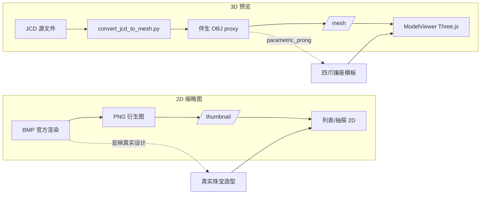

# 镶嵌库 2D 预览 vs 3D 实时预览差异分析报告

**日期**: 2026-07-03  
**范围**: `moje_company/3d_aigc_project` 镶嵌结构库 v2  
**案例**: `ba289.JCD` / `ba289.obj`，`3x2mm.jcd` / `3x2mm.obj`

---

## 1. 问题现象复述

| 案例 | 2D 缩略图（用户观察） | 3D 实时预览（用户观察） |
|------|----------------------|------------------------|
| **ba289** | 金色金属扣/夹（与 JewelCAD 设计一致） | 白色图钉/锥形（底座 + 若干圆柱爪） |
| **3x2mm** | （梨形镶口类，预期为梨形镶座） | 灰色底座 + 三根针状物，与预期不符 |

**共性**: 多数条目的 3D 预览呈现相似的「底座 + 爪针」形态，与 2D 差异巨大。

---

## 2. 完整数据流

### 2.1 2D 缩略图链路

```
镶嵌结构数据库/
  ├─ *.bmp          ← JewelCAD 官方渲染（2012 等原始文件，最可信）
  ├─ *.png          ← BMP 转换 / JCD 内嵌 BMP / 点云投影 / mesh 渲染
  └─ *.jcd
        ↓
InlayImportService.enrichPreviewInfo()
  优先级: .png → .jpg → .jpeg → .webp → .bmp（先命中者入库）
        ↓
GET /api/inlay/v2/items/{id}/thumbnail
  InlayCatalogService.getThumbnail()
  → asset: thumb_webp | preview_png | preview_hd
  → legacy fallback: 同目录 baseName.{png,webp,jpg,bmp}
        ↓
InlayLibraryView.vue / InlaySelector.vue
  
```

**要点**: 2D 预览**优先来自 BMP/PNG 位图**，反映 JewelCAD 原始设计外观，**不读取 OBJ**。

### 2.2 3D 实时预览链路

```
镶嵌结构数据库/
  └─ *.obj          ← 伴生网格（当前大量为脚本生成的 proxy）
        ↓
InlayImportService.importJcdRecord()
  mesh_ready = (同目录同名 .obj 存在)
  registerAsset(..., mesh_obj, ...)
        ↓
GET /api/inlay/v2/items/{id}/mesh/glb   ← 前端首选
GET /api/inlay/v2/items/{id}/mesh       ← GLB 失败时 OBJ 降级
  InlayCatalogService.getMesh()
  → mesh_glb（通常不存在）→ mesh_obj → legacy 同目录 .obj
        ↓
InlayPreviewPanel.vue
  meshUrl: /api/inlay/v2/items/{uuid}/mesh/glb
  onMeshError → useObjFallback = true → /mesh
        ↓
ModelViewer.vue (Three.js)
  GLTFLoader / OBJLoader 加载真实响应体
  无材质 OBJ → MeshStandardMaterial(color: 0xcccccc)  ← 灰色/白色观感
  **无内置占位几何体，加载失败则 emit error**
```

**要点**: 3D 预览**忠实渲染 API 返回的 OBJ/GLB 文件内容**；当前问题不是前端 fallback 占位，而是 **OBJ 本身即为合成 proxy 网格**。

### 2.3 数据流对比图



---

## 3. 根因分析

### 3.1 主根因：伴生 OBJ 为「四爪镶 proxy」，非 JCD 真实几何

`scripts/convert_jcd_to_mesh.py` 的设计目标明确为**融合管线占位网格**，而非 CAD 精确导出：

| 条件 | 转换策略 | method 标识 |
|------|----------|-------------|
| JCD ≤ 50KB 且含 `SILKIDEASIGN` 头 | 按文件名解析直径，**程序化生成四爪镶** | `parametric_prong_d{X}mm` |
| 大文件且点云提取成功 | Open3D Poisson 重建 | `pointcloud_poisson` |
| 其他 | 仍 fallback 到四爪 parametric | `parametric_fallback_d{X}mm` |

四爪 proxy 由 `trimesh.creation.cylinder` 构成：

- 1 个座圈（seat）
- 1 个 gallery 环
- **4 根倾斜圆柱爪**（`num_prongs=4`）

在 Three.js 默认灰色材质下，视觉上即为用户描述的 **「白色图钉 / 锥形 / 针状物」**。

**指纹特征**（两案例 OBJ 均符合）：

- 文件头 `# https://github.com/mikedh/trimesh`
- **524 顶点 / 1024 面**（固定拓扑）
- 文件大小约 **32.4 KB**
- 修改时间 **2026-06-26**（批量转换时间戳，远晚于 JCD 原始日期）

### 3.2 次根因：2D 与 3D 使用完全不同的资产源

| 维度 | 2D | 3D |
|------|----|----|
| 数据源 | BMP / PNG（JewelCAD 渲染） | 伴生 OBJ |
| 是否反映 JCD 几何 | 是（视觉设计） | **否**（proxy 模板） |
| ba289 情况 | `BA289.bmp`（2012）→ `ba289.png` | `ba289.obj`（2026 proxy） |
| 3x2mm 情况 | 无 BMP；PNG 后由 mesh 渲染更新 | `3x2mm.obj`（2026 proxy） |

系统**未校验** 2D 与 3D 是否同源，也未标记 mesh 为 synthetic/proxy。

### 3.3 非根因（已排除）

| 假设 | 结论 |
|------|------|
| ModelViewer 静默显示占位图钉 | **排除**。无 placeholder mesh；失败会 emit error，InlayPreviewPanel 才切换 GLB→OBJ |
| API 返回错误条目/空 mesh | **排除**。`getMesh` 按 item id 解析 legacy 同目录 `.obj`，逻辑正确 |
| Docker 挂载导致读错文件 | **排除**。`inlay_db` 只读挂载正确；mesh 解析 fallback 到同目录 basename.obj，路径逻辑与宿主机一致 |
| GLB 转换污染 | **影响小**。多数条目无 GLB；前端 GLB 404 后降级到同一 OBJ |

### 3.4 文件名解析缺陷（加剧 3x2mm 失真）

`3x2mm.jcd` 的直径解析：

```python
# parse_stone_diameter_mm("3x2mm")
# mm 后缀正则命中 "2mm" → diameter = 2.0
# 未进入 "3x2" 分支取 max(3,2)
```

实际生成 **`parametric_prong_d2mm`**，与「3×2mm 梨形镶口」语义不符，进一步偏离预期。

`ba289` 无法解析直径 → 默认 **`parametric_prong_d0.7mm`**，与「金属扣/夹」配件完全无关。

---

## 4. 案例追踪

### 4.1 ba289（画图配件/aa/文件/P/ba289.JCD）

**磁盘文件**（`镶嵌结构数据库/画图配件/aa/文件/P/`）：

| 文件 | 大小 | 时间 | 说明 |
|------|------|------|------|
| ba289.JCD | 11,033 B | 2012-07-23 | SILKIDEASIGN 头，小文件 |
| BA289.bmp | 30,056 B | 2012-07-23 | JewelCAD 官方渲染 → **2D 金色扣/夹来源** |
| ba289.png | 48,075 B | 2026-06-26 | 由 BMP 增强生成，quality≈0.886 |
| ba289.obj | 32,462 B | 2026-06-26 | **proxy: parametric_prong_d0.7mm**, 524v/1024f |

**manifest**（`convert_all_inlays_manifest.jsonl`）：

```json
{"rel": "画图配件/aa/文件/P/ba289.JCD", "has_bmp": true, "has_obj": true,
 "png_quality": 0.8859, "png_is_placeholder": false, "need_mesh": false}
```

**转换验证**（`convert_jcd_to_mesh.py --dry-run --force`）：

```
parse_diameter: None → parametric_prong_d0.7mm, verts=524, faces=1024
```

**结论**:

- 2D = 真实 BMP 渲染（金属扣）
- 3D = 0.7mm 四爪镶模板（与扣/夹无关）
- **3D 真实反映 OBJ 文件，但 OBJ 不是 JCD 的真实几何**

### 4.2 3x2mm（广州资料库/梨形镶口/3x2mm.jcd）

**磁盘文件**：

| 文件 | 大小 | 时间 | 说明 |
|------|------|------|------|
| 3x2mm.jcd | 12,401 B | 2020-06-12 | SILKIDEASIGN 头 |
| 3x2mm.obj | 32,463 B | 2026-06-26 | **proxy: parametric_prong_d2mm** |
| 3x2mm.png | 20,218 B | 2026-06-26 | 由 mesh 渲染更新 |

**manifest**:

```json
// scan
{"rel": "广州资料库/梨形镶口/3x2mm.jcd", "has_bmp": false,
 "png_is_placeholder": true, "need_preview": true}

// preview 阶段
{"phase": "preview", "method": "mesh_smooth_shaded", "quality": 0.1276}
```

**转换验证**:

```
parse_diameter: 2.0 → parametric_prong_d2mm, verts=524, faces=1024
```

**结论**:

- 无 BMP；原 PNG 为 JCD 占位图（quality>0.9）
- 预览刷新后 2D 也来自 **同一 proxy OBJ** 的 matplotlib 渲染（`mesh_smooth_shaded`），但材质/角度与 Three.js 灰色实时预览仍有视觉差
- 3D 仍为 2mm 四爪模板，**不是梨形镶口**

---

## 5. 3D 预览「真实性」评估

| 评估项 | 结论 |
|--------|------|
| 是否真实反映磁盘上的 `.obj` 文件？ | **是**。Three.js 正确加载 API 流式返回的 OBJ |
| 是否真实反映 `.jcd` / JewelCAD 设计？ | **否**。当前 OBJ 为 `convert_jcd_to_mesh.py` 生成的 **融合占位 proxy** |
| 是否为前端假模型/默认几何？ | **否**。形状来自后端 OBJ，非 ModelViewer 内置占位 |
| 是否可用于选型/质检？ | **不可**。仅可判断「有无可融合 mesh」，不能判断造型是否正确 |
| mesh_ready 字段含义 | **误导性**。仅表示「同目录有 OBJ」，不表示「几何正确」 |

**一句话**: 3D 预览是 **「proxy OBJ 的真实渲染」**，不是 **「JCD 设计的真实还原」**。

---

## 6. Docker 环境说明

`docker-compose.yml` 相关挂载：

```yaml
business-service:
  volumes:
    - ./镶嵌结构数据库:/app/inlay_db:ro      # legacy 源 + sidecar 文件
    - inlay-storage:/app/inlay-storage        # import 复制的 mesh/preview
    - inlay-cache:/app/inlay_cache            # 融合缓存
  environment:
    INLAY_DB_PATH: /app/inlay_db
    inlay-v2.storage.local-root: /app/inlay-storage
    inlay-v2.legacy-fallback: true
```

- `inlay_db` 只读：正确，防止容器内误改原始库
- Mesh 读取顺序：DB asset（inlay-storage 或 `legacy:` key）→ `resolveLegacyPreviewOrMesh` 读 `/app/inlay_db/{legacy_path 同目录}.obj`
- **容器与宿主机看到相同 proxy OBJ**，非 Docker 特有问题

**API 实测**: 调查时 `localhost:8854` 无响应（服务未启动），未能 curl 验证 HTTP 响应体；依据源码与磁盘文件分析，响应内容与 sidecar OBJ 一致。

---

## 7. 修复建议（按优先级）

### P0 — 立即（产品/数据正确性）

1. **在 UI 标注 mesh 来源**  
   当 OBJ 为 `parametric_prong_*` / `parametric_fallback_*` 时，3D 面板显示「合成占位网格，非真实造型」；`mesh_ready` 改为「可融合（占位）」或拆分 `mesh_proxy` / `mesh_verified` 字段。

2. **禁止对非镶口类 JCD 自动生成四爪 proxy**  
   `ba289` 等「画图配件」路径应跳过 parametric 分支，或按目录/标签白名单限制 proxy 生成范围（如仅 `爪/`、`四爪镶口/`）。

3. **修复 `parse_stone_diameter_mm("3x2mm")`**  
   对 `NxMmm` 模式优先解析双维度，避免 `2mm` 后缀误匹配。

### P1 — 短期（提升 3D 可信度）

4. **在 `inlay_item` / `inlay_asset` 记录 `mesh_method`**  
   转换时写入 `parametric_prong` / `pointcloud_poisson` 等，API 返回给前端。

5. **2D 预览策略与 3D 对齐提示**  
   当 2D 来自 BMP 而 3D 来自 proxy 时，抽屉内显式警告「2D 为 CAD 渲染，3D 为融合占位体」。

6. **重新评估批量转换**  
   对已有 proxy OBJ（524v/1024f 指纹）批量标记；配件类删除 proxy 并设 `mesh_ready=false`。

### P2 — 中期（真正几何还原）

7. **真实 JCD→mesh 管线**  
   JewelCAD 官方导出、专用解析器、或仅对大文件启用 Poisson；**小文件 parametric 仅作为融合最后手段**。

8. **可选 GLB 流水线**  
   真实 mesh 转 GLB 后前端首选 GLB，保留 OBJ 兼容。

9. **导入时 2D 优先 BMP 元数据**  
   `enrichPreviewInfo` 中 BMP 优先级应高于 PNG，避免 `preview_method` 丢失「来自官方渲染」信息。

### P3 — 长期

10. **自动化一致性检测**  
    对比 BMP 轮廓与 mesh 投影 IoU / 体积比；低于阈值拒绝标记 `mesh_ready`。

---

## 8. 相关源码索引

| 组件 | 路径 |
|------|------|
| 3D 面板 + GLB→OBJ 降级 | `frontend/src/components/InlayPreviewPanel.vue` |
| Three.js 加载（无占位 mesh） | `frontend/src/components/ModelViewer.vue` |
| Mesh API | `business-service/.../InlayV2Controller.java` |
| Mesh 解析 + legacy fallback | `business-service/.../InlayCatalogService.java` |
| Legacy 导入与 mesh 关联 | `business-service/.../InlayImportService.java` |
| **Proxy OBJ 生成** | `scripts/convert_jcd_to_mesh.py` |
| 2D 预览编排 | `scripts/convert_all_inlays.py`, `generate_jcd_previews.py`, `generate_mesh_previews.py` |
| Docker 配置 | `docker-compose.yml`, `application-docker.yml` |

---

## 9. 核心结论摘要

1. **2D 预览**来自 BMP/PNG（JewelCAD 渲染），能反映真实设计外观。  
2. **3D 预览**来自伴生 OBJ，当前大量 OBJ 为 `convert_jcd_to_mesh.py` 生成的 **四爪镶 proxy**（524 顶点固定模板），与 JCD 真实造型无关。  
3. 前端 **没有** 静默图钉占位；用户看到的「图钉/锥形/针」**就是 proxy OBJ 的真实 Three.js 渲染**（灰色默认材质）。  
4. `ba289`：BMP(2012) vs OBJ(2026 proxy d=0.7mm)；`3x2mm`：proxy d=2mm，与梨形镶口预期不符。  
5. **3D 预览对 OBJ 文件真实，对 JCD 设计不真实**；修复需从 mesh 生成策略与元数据标注入手，而非前端 3D 组件。
