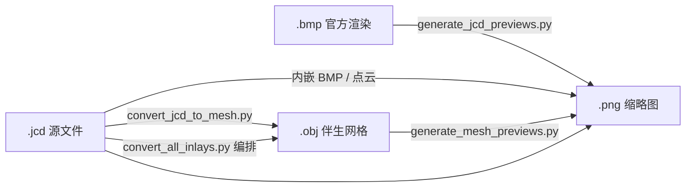
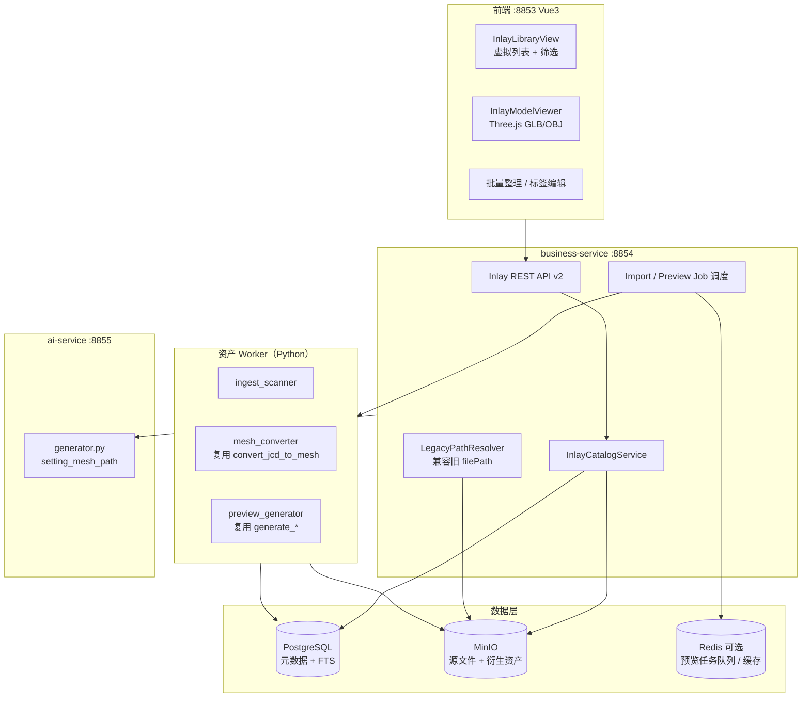
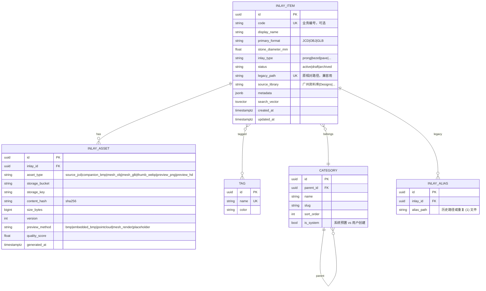
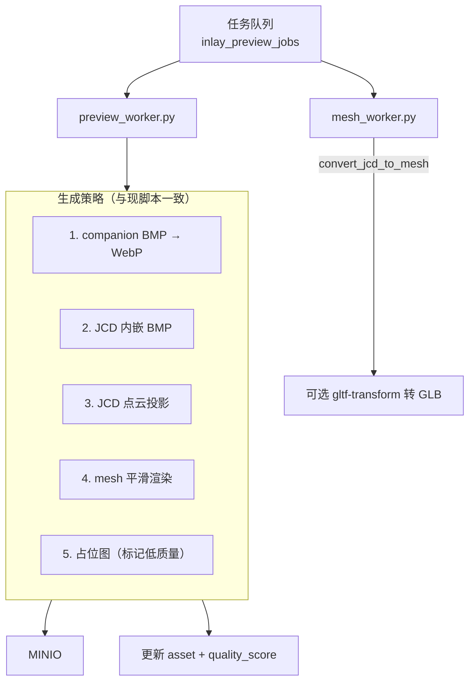
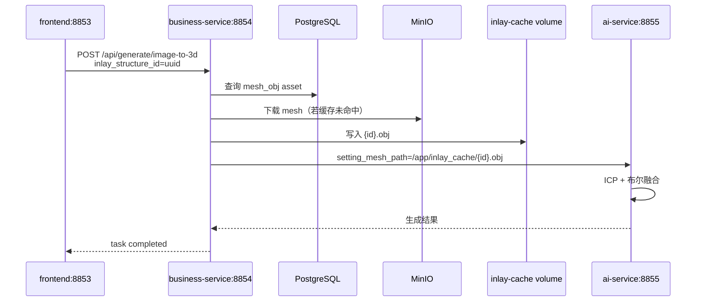

# 镶嵌结构数据库重构设计方案

> **项目路径**：`D:\Hui_Loading\moje_company\3d_aigc_project`  
> **文档版本**：v1.0  
> **日期**：2026-07-01  
> **范围**：仅设计文档；不涉及本阶段业务代码改动

---

## 目录

1. [现状分析与问题根因](#1-现状分析与问题根因)
2. [设计目标与原则](#2-设计目标与原则)
3. [总体架构](#3-总体架构)
4. [数据模型](#4-数据模型)
5. [MinIO 对象存储规划](#5-minio-对象存储规划)
6. [导入与迁移策略](#6-导入与迁移策略)
7. [预览图与 3D 资产统一生成流水线](#7-预览图与-3d-资产统一生成流水线)
8. [API 设计](#8-api-设计)
9. [前端 UX 设计](#9-前端-ux-设计)
10. [索引与搜索方案](#10-索引与搜索方案)
11. [性能优化策略](#11-性能优化策略)
12. [分阶段实施路线图](#12-分阶段实施路线图)
13. [与现有 8853/8854/8855 服务集成](#13-与现有-885388548855-服务集成)
14. [风险与备选方案](#14-风险与备选方案)

---

## 1. 现状分析与问题根因

### 1.1 当前数据与目录结构

镶嵌结构数据以**纯文件夹仓库**形式存放在项目根目录：

```
3d_aigc_project/
├── 镶嵌结构数据库/              # 主数据目录（inlay-db.path 指向此处）
│   ├── .inlay-index.json        # 全量扫描缓存（约 14k 条，体积大）
│   ├── Ast/                     # 示例子库
│   ├── Designs/Bangles/         # 英文设计分类
│   ├── 广州资料库/              # 地区资料
│   ├── 配件资料庫/              # 配件、微镶、链扣等
│   ├── 铲丁镶/                  # 按工艺分类
│   ├── 资料库（啊雄）/          # 个人/来源命名
│   └── …（多来源、多层级、命名不统一）
├── scripts/
│   ├── convert_all_inlays.py    # 全量编排：scan → mesh → preview
│   ├── convert_jcd_to_mesh.py   # JCD → 伴生 OBJ
│   ├── generate_jcd_previews.py
│   ├── generate_mesh_previews.py
│   ├── bmp_to_png_preview.py
│   ├── fix_bad_previews.py
│   └── convert_all_inlays_manifest.jsonl  # 批处理审计日志
└── business-service/ …          # Java 扫描 + REST
```

**实测规模（2026-06-27 索引快照 `.inlay-index.json`）**：

| 指标 | 数量 | 说明 |
|------|------|------|
| 索引条目总数 | **14,398** | 含 JCD 与伴生 OBJ 分别计条 |
| JCD 条目 | **7,199** | `convert_all_inlays_manifest.jsonl` scan 阶段一致 |
| OBJ 伴生网格 | **7,199** | 与 JCD 基本 1:1（转换脚本产出） |
| 同目录 BMP | **3,976 / 7,199 JCD（55%）** | JewelCAD 官方渲染图来源 |
| 扫描时占位 PNG | **3,139** | `png_is_placeholder: true` |
| 批处理预览成功 | **3,132** | 单次全量 preview 约 **13.9 小时**（`elapsed_s: 50020`） |

> 用户感知的「约 14k 条目、~4k BMP、覆盖率 ~27%」与当前索引基本一致：14k 为**目录索引条目**（JCD+OBJ 双计）；若只统计 JCD 则 BMP 覆盖率约 55%，历史低覆盖率阶段主要因 PNG 未批量生成或仍为占位图。

**目录特征问题**：

- 多来源并列（`Designs/`、`广州资料库/`、`配件资料庫/` 等），**语义分类依赖路径字符串**。
- 大量 `(1)` 重复文件（Windows 复制遗留），索引与 UI 均展示为独立条目。
- `_jcd_archive/` 归档目录与主文件并存，需特殊排除逻辑（见 `InlayStructureService.isArchivePath`）。
- 伴生资产与源文件**同目录散落**：`.jcd`、`.bmp`、`.obj`、`.png` 四文件模式不统一。

### 1.2 当前软件架构

```
浏览器 :8853 (Vue3 + Element Plus)
    │  /api → vite proxy
    ▼
business-service :8854 (Spring Boot)
    │  InlayStructureService：Filesystem.walk + 内存索引
    │  GenerateService.resolveInlayMeshPath() → 本地绝对路径
    ▼
ai-service :8855 (FastAPI + Hunyuan3D)
    │  setting_mesh_path 指向镶嵌库 OBJ/GLB/STL
    ▼
镶嵌结构数据库/ （Docker 挂载 /app/inlay_db:ro）
```

**关键代码触点**：

| 模块 | 文件 | 职责 |
|------|------|------|
| 配置 | `business-service/.../InlayDbConfig.java` | `inlay-db.path: ../镶嵌结构数据库` |
| 索引 | `InlayStructureService.java` | 全目录扫描、`.inlay-index.json` 持久化、内存过滤分页 |
| API | `InlayStructureController.java` | `/api/inlay/list|categories|preview|upload|refresh` |
| 融合 | `GenerateService.java` | `resolveInlayMeshPath()` 解析 JCD→伴生 OBJ |
| 前端选择器 | `frontend/src/components/InlaySelector.vue` | 关键词/目录/格式筛选，**仅 2D 缩略图** |
| 3D 查看 | `frontend/src/components/ModelViewer.vue` | Three.js，**仅用于生成结果**，未接入镶嵌库 |
| 批处理 | `scripts/convert_all_inlays.py` 等 | 离线 mesh/预览流水线 |

### 1.3 用户痛点与根因对照

| # | 痛点 | 根因 |
|---|------|------|
| 1 | **无合理三维查看** | 镶嵌库 UI 只有 44×44 缩略图；`ModelViewer` 未绑定 `/api/inlay` 网格下载；JCD 格式浏览器无法直接渲染 |
| 2 | **预览图参差不齐** | 预览来源 4 链路并行（BMP / 内嵌 BMP / 点云 / mesh 渲染 / 占位图），质量阈值 `MIN_QUALITY=0.035` 仅脚本侧检测，**未写入索引元数据** |
| 3 | **文件夹混乱、无法交互整理** | 分类 = 路径前缀树；无标签、无合并重复、无拖拽；上传仅 `saveUploadedFile(originalFilename)` **扁平落盘** |
| 4 | **索引与查找低效** | 每次查询遍历内存 List 做 `contains` 匹配；14k 条目全量加载；文件名重复时 `filenameIndex` 只保留首个 |
| 5 | **展示与渲染性能差** | 缩略图经 Java `FileSystemResource` 直读磁盘；前端 `InlaySelector` 普通滚动列表（非虚拟列表）；索引 JSON 体积大、启动反序列化慢 |

### 1.4 现有批处理流水线（JCD/BMP/PNG/Mesh）



**现状缺陷**：流水线与业务索引**解耦**——跑完脚本需手动 `POST /api/inlay/refresh`；manifest 在 `scripts/` 下，未进入可查询数据库；预览质量、生成方式未暴露给 API/前端。

---

## 2. 设计目标与原则

### 2.1 目标

1. **一条逻辑记录 = 一个镶嵌结构**（JCD 为主键语义，OBJ/GLB 为衍生资产），消除 JCD/OBJ 双条目。
2. **统一预览**：256×256 WebP 缩略图 + 可选 512 高清预览；记录 `preview_source` 与 `quality_score`。
3. **浏览器内 3D 预览**：基于现有 Three.js `ModelViewer`，加载 GLB（优先）或 OBJ。
4. **可编辑元数据**：标签、工艺分类、主石直径、来源库、状态（草稿/已审/废弃）。
5. **高效检索**：毫秒级条件查询 + 中文模糊搜索；支持批量整理。
6. **与轨道 A 融合零回归**：`GenerateService` 仍能通过 ID 解析本地/MinIO 网格路径给 ai-service。

### 2.2 原则

| 原则 | 说明 |
|------|------|
| **渐进迁移** | 文件夹只读保留；DB+MinIO 为逻辑层，物理文件可双写过渡期共存 |
| **复用现有脚本** | `convert_*` / `generate_*` 作为 Worker 内核，不重写 JCD 解析 |
| **最小新技术栈** | MVP 用 PostgreSQL + MinIO + 现有 Spring/Vue；不上 Elasticsearch 除非 >10 万条 |
| **ID 稳定** | 新 UUID + `legacy_path` 映射，避免打断已有任务的 `inlay_structure_filename` |
| **衍生与源分离** | MinIO 分 bucket；源 JCD 不可变，mesh/预览可版本化重生成 |

---

## 3. 总体架构

### 3.1 目标架构图



### 3.2 组件职责

| 组件 | 技术选型 | 理由 |
|------|----------|------|
| 元数据库 | **PostgreSQL 16** | Spring Data JPA 成熟；JSONB 存扩展字段；内置 FTS + pg_trgm |
| 对象存储 | **MinIO**（S3 兼容） | 与 Docker 本地部署一致；支持预签名 URL；可换 AWS S3 |
| 任务队列 | **Redis + Spring @Scheduled**（MVP） | 预览生成异步化；后续可换 Celery |
| 搜索 | **PostgreSQL FTS**（主） | 14k 规模足够；运维简单 |
| 3D 传输格式 | **GLB 预览 + OBJ 融合** | 前端 Three.js 已支持；ai-service 融合管线已认 OBJ |

---

## 4. 数据模型

### 4.1 核心实体关系



### 4.2 主要表结构（PostgreSQL DDL 要点）

```sql
-- 镶嵌主表：一条记录对应一个「逻辑镶嵌结构」
CREATE TABLE inlay_item (
    id              UUID PRIMARY KEY DEFAULT gen_random_uuid(),
    code            VARCHAR(64),
    display_name    VARCHAR(512) NOT NULL,
    primary_format  VARCHAR(16) NOT NULL DEFAULT 'JCD',
    stone_diameter_mm REAL,
    inlay_type      VARCHAR(32),          -- prong / bezel / channel / ...
    status          VARCHAR(16) NOT NULL DEFAULT 'active',
    legacy_path     VARCHAR(1024) UNIQUE, -- 如 "配件资料庫/微虎爪/+1.5.jcd"
    source_library  VARCHAR(128),
    category_id     UUID REFERENCES category(id),
    mesh_ready      BOOLEAN NOT NULL DEFAULT FALSE,
    has_preview     BOOLEAN NOT NULL DEFAULT FALSE,
    preview_quality REAL,
    metadata        JSONB DEFAULT '{}',
    search_vector   TSVECTOR,
    created_at      TIMESTAMPTZ NOT NULL DEFAULT NOW(),
    updated_at      TIMESTAMPTZ NOT NULL DEFAULT NOW()
);

CREATE INDEX idx_inlay_item_status ON inlay_item(status);
CREATE INDEX idx_inlay_item_category ON inlay_item(category_id);
CREATE INDEX idx_inlay_item_mesh_ready ON inlay_item(mesh_ready);
CREATE INDEX idx_inlay_item_search ON inlay_item USING GIN(search_vector);
CREATE INDEX idx_inlay_item_name_trgm ON inlay_item USING GIN(display_name gin_trgm_ops);
CREATE INDEX idx_inlay_item_legacy ON inlay_item(legacy_path);

-- 资产表：MinIO 对象引用
CREATE TABLE inlay_asset (
    id              UUID PRIMARY KEY DEFAULT gen_random_uuid(),
    inlay_id        UUID NOT NULL REFERENCES inlay_item(id) ON DELETE CASCADE,
    asset_type      VARCHAR(32) NOT NULL,
    storage_bucket  VARCHAR(64) NOT NULL,
    storage_key     VARCHAR(1024) NOT NULL,
    content_hash    CHAR(64),
    size_bytes      BIGINT,
    version         INT NOT NULL DEFAULT 1,
    preview_method  VARCHAR(32),
    quality_score   REAL,
    is_current      BOOLEAN NOT NULL DEFAULT TRUE,
    generated_at    TIMESTAMPTZ,
    UNIQUE(inlay_id, asset_type, version)
);

-- 标签多对多
CREATE TABLE inlay_tag (
    inlay_id UUID REFERENCES inlay_item(id) ON DELETE CASCADE,
    tag_id   UUID REFERENCES tag(id) ON DELETE CASCADE,
    PRIMARY KEY (inlay_id, tag_id)
);

-- 导入/预览任务审计（替代 jsonl manifest）
CREATE TABLE inlay_job_log (
    id          UUID PRIMARY KEY DEFAULT gen_random_uuid(),
    job_type    VARCHAR(32),  -- scan|mesh|preview|migrate
    inlay_id    UUID,
    status      VARCHAR(16),
    method      VARCHAR(32),
    detail      JSONB,
    duration_ms INT,
    created_at  TIMESTAMPTZ DEFAULT NOW()
);
```

### 4.3 逻辑记录合并规则（解决双条目）

迁移时按以下优先级将 **JCD 与伴生 OBJ 合并为一条 `inlay_item`**：

1. 若同目录存在 `{basename}.jcd` → 以 JCD 为主记录，`primary_format=JCD`。
2. 伴生 `{basename}.obj` 写入 `inlay_asset(asset_type=mesh_obj)`，并设 `mesh_ready=true`。
3. 若仅有 OBJ/STL/GLB、无 JCD → 独立记录，`primary_format=OBJ|GLB|STL`。
4. `{name}(1).jcd` 与 `{name}.jcd` → 默认合并为 alias 或标记 `duplicate_of`（人工审核队列）。

**对外 ID 策略**：

- 新 API 使用 `UUID`。
- 保留 `legacy_path` 字段；`GET /api/inlay/v2/items?legacy_path=...` 兼容旧前端 `id=filePath` 写法。
- `GenerateService.resolveInlayMeshPath()` 先查 DB 取 `mesh_obj` 本地缓存路径，未命中再回退旧目录扫描（迁移期）。

---

## 5. MinIO 对象存储规划

### 5.1 Bucket 设计

| Bucket | 内容 | 访问 | 生命周期 |
|--------|------|------|----------|
| `inlay-source` | 原始 `.jcd`、`.bmp` | 内部读写 | 永久 |
| `inlay-mesh` | `.obj`、`.glb`、`.stl` | 内部读；前端预签名 | 可版本覆盖 |
| `inlay-preview` | `.webp` 缩略图、`.png` 高清 | **CDN/公开读** | 随重生成更新 |
| `inlay-temp` | 上传中转、失败重试 | 私有 | 7 天自动清理 |

### 5.2 Object Key 规范

```
inlay-source/{source_library}/{category_slug}/{inlay_id}/v{version}/source.jcd
inlay-mesh/{inlay_id}/v{version}/mesh.obj
inlay-mesh/{inlay_id}/v{version}/mesh.glb      # 可选，前端 3D 优化
inlay-preview/{inlay_id}/thumb_256.webp
inlay-preview/{inlay_id}/preview_512.webp
```

**设计理由**：

- Key 含 `inlay_id` 而非 legacy 中文路径，避免 URL 编码与跨平台路径问题。
- `legacy_path` 仅存 DB，对象存储与文件系统解耦。
- WebP 缩略图体积约为 PNG 的 30–50%，减轻列表加载。

### 5.3 本地缓存（融合管线）

ai-service 需要**本地可读文件路径**（`setting_mesh_path`）。business-service 在提交任务前：

1. 查 `inlay_asset(mesh_obj)` 的 MinIO key；
2. 下载到 `uploads/inlay_cache/{inlay_id}.obj`（LRU 缓存，如 512MB）；
3. 将缓存绝对路径传给 ai-service。

Docker 部署时在 business-service 与 ai-service 间**共享 volume** `inlay-cache`，避免重复下载。

---

## 6. 导入与迁移策略

### 6.1 迁移阶段


### 6.2 导入脚本设计

新增 `scripts/migrate_inlay_to_db.py`（调用现有模块）：

```bash
# 1. 扫描 legacy 目录，输出候选（复用 convert_all_inlays.scan_entry）
python scripts/migrate_inlay_to_db.py --phase scan --manifest migration_scan.jsonl

# 2. 上传源文件到 MinIO，写入 PostgreSQL（批量 500）
python scripts/migrate_inlay_to_db.py --phase upload --workers 4

# 3. 触发 mesh/预览 Worker（复用 convert_all_inlays 逻辑）
python scripts/migrate_inlay_to_db.py --phase assets --skip-good-preview

# 4. 校验：legacy_path 双向映射抽样 1%
python scripts/migrate_inlay_to_db.py --phase verify
```

**合并与去重逻辑**：

| 场景 | 处理 |
|------|------|
| 同目录 `a.jcd` + `a.obj` + `a.png` | 1 条 item + 3 条 asset |
| 仅 `a.obj` | 1 条 item，primary_format=OBJ |
| `a.jcd` 与 `a(1).jcd` 内容 hash 相同 | 合并，`(1)` 写入 `inlay_alias` |
| hash 不同 | 保留两条，打 `duplicate_candidate` 标签 |
| `_jcd_archive/` 下文件 | 仅作 source 备份 asset，不单独建 item |

### 6.3 回滚策略

- 迁移期 **不删除** `镶嵌结构数据库/` 原文件。
- `inlay-db.path` 与 `INLAY_DB_PATH` 保留；v2 API 异常时可切回 v1 `/api/inlay/list`。
- PostgreSQL 每日快照；MinIO 版本控制开启。

---

## 7. 预览图与 3D 资产统一生成流水线

### 7.1 流水线架构



### 7.2 统一质量标准

| 字段 | 规则 |
|------|------|
| `quality_score` | 复用 `generate_jcd_previews.preview_quality()` |
| `preview_method` | `bmp` / `embedded_bmp` / `pointcloud` / `mesh_render` / `placeholder` |
| `has_preview` | `quality_score >= 0.035` 且非 placeholder |
| 缩略图规格 | 256 WebP quality=82；可选 512 详情页 |
| 3D 预览规格 | 优先 serve `mesh.glb`（Draco 压缩可选）；无 GLB 则 OBJ |

### 7.3 触发时机

| 事件 | 动作 |
|------|------|
| 新上传 JCD | 入队 mesh + preview |
| 手动「重新生成预览」 | 单条高优先级任务 |
| 批量「修复低质量预览」 | 复用 `fix_bad_previews` 条件：`quality < 0.035` |
| 定时巡检 | 每周扫描 `has_preview=false` 或 `placeholder` |

### 7.4 与现有 manifest 的关系

`scripts/*_manifest.jsonl` 迁移写入 `inlay_job_log` 表，保留 jsonl 导出能力供离线分析。

---

## 8. API 设计

### 8.1 版本策略

- **v1**（现有）：`/api/inlay/*` — 迁移期继续维护，标记 `@Deprecated`。
- **v2**（新）：`/api/inlay/v2/*` — 基于 PostgreSQL + MinIO。

### 8.2 REST 端点要点

#### 查询与列表

```
GET /api/inlay/v2/items
  ?q=四爪                  # 全文/模糊
  &category_id=uuid
  &tags=prong,micro        # 多标签 AND
  &inlay_type=prong
  &mesh_ready=true
  &has_preview=true
  &preview_method=bmp      # 排除 placeholder
  &stone_diameter_min=0.5
  &stone_diameter_max=1.0
  &status=active
  &sort=updated_at:desc
  &page=1&page_size=50

GET /api/inlay/v2/items/{id}
GET /api/inlay/v2/items/by-legacy-path?path=配件资料庫/.../a.jcd  # 兼容
```

#### 资产与 3D

```
GET  /api/inlay/v2/items/{id}/thumbnail        → 302 到 MinIO/CDN 或 proxy
GET  /api/inlay/v2/items/{id}/mesh             → OBJ/GLB 流（Content-Disposition）
GET  /api/inlay/v2/items/{id}/mesh/glb         → 前端 3D 专用
POST /api/inlay/v2/items/{id}/regenerate-preview
POST /api/inlay/v2/items/{id}/convert-mesh
```

#### 整理与编辑

```
PATCH /api/inlay/v2/items/{id}                 # display_name, category, tags, inlay_type, status
POST  /api/inlay/v2/items/batch                # 批量打标签、改分类、归档
POST  /api/inlay/v2/items/merge               # 合并重复项
POST  /api/inlay/v2/items/{id}/move           # 逻辑移动（改 category，非物理路径）
POST  /api/inlay/v2/upload                     # multipart → MinIO + DB
```

#### 分类与标签

```
GET  /api/inlay/v2/categories                  # 树形，来自 category 表
POST /api/inlay/v2/categories
GET  /api/inlay/v2/tags
POST /api/inlay/v2/tags
```

#### 统计与任务

```
GET  /api/inlay/v2/stats                       # 格式、预览覆盖、mesh_ready
GET  /api/inlay/v2/jobs?status=running
POST /api/inlay/v2/import/scan-legacy          # 触发迁移扫描
```

### 8.3 响应 DTO 示例

```json
{
  "id": "550e8400-e29b-41d4-a716-446655440000",
  "display_name": "四爪微镶 0.7",
  "legacy_path": "配件资料庫/微镶种类/四爪微镶(桶+爪)/0.7.jcd",
  "primary_format": "JCD",
  "mesh_ready": true,
  "has_preview": true,
  "preview_quality": 0.2665,
  "preview_method": "bmp",
  "stone_diameter_mm": 0.7,
  "inlay_type": "prong",
  "tags": ["微镶", "四爪"],
  "category": { "id": "...", "name": "四爪微镶" },
  "thumbnail_url": "/api/inlay/v2/items/{id}/thumbnail",
  "mesh_glb_url": "/api/inlay/v2/items/{id}/mesh/glb",
  "file_size_bytes": 23840,
  "updated_at": "2026-06-27T01:11:48+08:00"
}
```

### 8.4 GraphQL（可选，完整版）

若后续需要复杂筛选 UI，可增加 `/graphql` 单端点查询 `inlayItems(filter, page)`，MVP 阶段 **REST 足够**。

---

## 9. 前端 UX 设计

### 9.1 信息架构

```
/inlay-library          # 新：镶嵌库管理主页（独立路由）
  ├── 列表 + 虚拟滚动 + 卡片/表格切换
  ├── 左侧：分类树 + 标签云 + 高级筛选
  ├── 右侧抽屉：详情 + 3D 预览 + 元数据编辑
  └── 批量操作栏：打标签 / 改分类 / 归档 / 导出

HomeView（现有）        # 生成页内嵌精简选择器
  └── InlaySelector → 调用 v2 API，选中后仍传 legacy_path 或 id
```

### 9.2 列表页

| 元素 | 设计 |
|------|------|
| 布局 | 虚拟列表（`vue-virtual-scroller` 或 Element Plus `el-table-v2`） |
| 卡片 | 统一 256 WebP 缩略图；角标显示 `mesh_ready` / `preview_method` |
| 筛选 | 搜索框 + 分类 cascader + 标签多选 + 直径范围滑块 |
| 排序 | 更新时间 / 名称 / 质量分 / 使用次数（可选） |
| 分页 | 服务端分页，默认 50；滚动加载可选 |

### 9.3 3D 查看器

复用 `ModelViewer.vue`，扩展：

- 新增 `InlayPreviewPanel.vue`：选中条目后右侧加载 `mesh_glb_url`。
- 无 GLB 时回退 OBJ；加载失败提示「请先转换 mesh」并一键触发 `convert-mesh`。
- 控件：旋转/缩放/平移（已有 OrbitControls）、重置视角、线框切换、背景色。
- 性能：Draco GLB + `renderer.setPixelRatio(Math.min(devicePixelRatio, 2))`；单页仅挂载一个 viewer 实例。

### 9.4 批量整理

- 多选 → 拖拽到左侧分类树节点（改 `category_id`）。
- 标签编辑器：Autocomplete + 新建标签。
- 「查找重复」：按 `content_hash` 或文件名相似度分组，向导式合并。
- 变更写审计日志，支持撤销（软更新 `status`）。

### 9.5 与现有 InlaySelector 的关系

| 阶段 | 行为 |
|------|------|
| MVP | `InlaySelector` 改调 v2 list API；`id` 优先 UUID，保留 `legacy_path` 显示 |
| 完整版 | 生成页轻量选择器 + 跳转「在库中打开」深链接 |

---

## 10. 索引与搜索方案

### 10.1 推荐方案：PostgreSQL FTS + pg_trgm

**理由**：当前 1.4 万逻辑条目（合并后约 **7200**），PostgreSQL 单机足够；团队已有 Spring Boot，不引入 ES 集群运维。

**实现**：

```sql
-- 安装扩展
CREATE EXTENSION IF NOT EXISTS pg_trgm;

-- 搜索向量更新（display_name + legacy_path + tags + metadata）
UPDATE inlay_item SET search_vector =
  setweight(to_tsvector('simple', coalesce(display_name,'')), 'A') ||
  setweight(to_tsvector('simple', coalesce(legacy_path,'')), 'B') ||
  setweight(to_tsvector('simple', coalesce(metadata->>'notes','')), 'C');

-- 查询示例
SELECT id, display_name,
       ts_rank(search_vector, plainto_tsquery('simple', '四爪 0.7')) AS rank
FROM inlay_item
WHERE search_vector @@ plainto_tsquery('simple', '四爪 0.7')
   OR display_name % '四爪'
ORDER BY rank DESC
LIMIT 50;
```

> 中文分词：MVP 用 `simple` + trigram 模糊；完整版可接 **pg_jieba** 或应用层 IK 分词写入 `keywords` 数组。

### 10.2 标签与分类索引

| 维度 | 索引 |
|------|------|
| 分类 | `category_id` B-tree |
| 标签 | `inlay_tag` 联合主键 + `tag_id` 索引 |
| 数值 | `stone_diameter_mm` B-tree |
| 状态 | `(status, mesh_ready, has_preview)` 复合索引 |

### 10.3 Elasticsearch 何时引入

满足任一条件再评估：

- 逻辑条目 **> 10 万**
- 需要复杂聚合仪表盘（多维交叉分析）
- 跨库 federated search（多个 MinIO 区域）

备选：PostgreSQL + **Meilisearch** 轻量中文搜索（比 ES 运维简单）。

---

## 11. 性能优化策略

### 11.1 后端

| 问题 | 优化 |
|------|------|
| 全目录扫描 | 取消 `Files.walk`；改 DB 查询 + MinIO HEAD 校验 |
| 大 JSON 索引 | 废弃 `.inlay-index.json`；启动不再加载 14k 条目到堆内存 |
| 缩略图 IO | MinIO 公开读 + `Cache-Control: immutable, max-age=31536000` |
| 网格下载 | 预签名 URL 或 nginx `X-Accel-Redirect`；融合缓存 volume |
| 分页过滤 | SQL WHERE + LIMIT；禁止内存 `filtered.subList` |

### 11.2 前端

| 问题 | 优化 |
|------|------|
| 列表 DOM 过多 | 虚拟滚动，仅渲染可视区 ~20 行 |
| 缩略图并发 | `loading="lazy"` + IntersectionObserver（已有）+ CDN 域名分流 |
| 3D 加载慢 | 优先 Draco GLB；进度条；失败降级缩略图 |
| 筛选抖动 | 300ms debounce（已有）+ 请求 abortController 取消过期响应 |

### 11.3 批处理

| 问题 | 优化 |
|------|------|
| 全量 preview 13+ 小时 | Worker 水平扩展；`skip-good-preview`；按 `quality_score` 增量 |
| mesh 转换 CPU | 大文件限流 `workers=1-2`；小文件并行 |
| 重复转换 | `content_hash` 去重，同 hash 跳过 |

### 11.4 缓存层次

```
浏览器 → CDN/静态 thumb → business-service 短缓存(ETag)
       → PostgreSQL 查询结果 Redis 60s（stats/categories）
       → MinIO 对象
       → 本地 inlay-cache（融合用 mesh）
```

---

## 12. 分阶段实施路线图

### Phase 0：基线加固（1 周，可与 MVP 并行）

- [ ] 现有 `convert_all_inlays.py` 跑完剩余 7 条 preview 失败项
- [ ] 索引合并规则文档化：前端默认 **仅展示 JCD 主记录**（快速补丁：API 增加 `primary_only=true` 过滤 OBJ 重复）
- [ ] 统计面板：preview_method 分布写入临时 JSON

### Phase 1：MVP（3–4 周）

**目标**：DB+MinIO 跑通，列表/搜索/缩略图可用，融合链路不中断。

| 任务 | 交付 |
|------|------|
| Docker 增加 PostgreSQL + MinIO | `docker-compose.yml` 新服务 |
| 表结构 + Flyway 迁移 | `business-service` 新 module |
| `migrate_inlay_to_db.py` scan + upload | 7200 条逻辑记录入库 |
| v2 REST：`items` list/get/thumbnail | Postman 集合 |
| `InlaySelector` 切 v2 + `primary_only` | 生成页可用 |
| `LegacyPathResolver` | `GenerateService` 兼容 |
| 缩略图 proxy 或 MinIO 直连 | 列表加载 < 2s（50 条） |

**MVP 不包含**：3D 查看、批量整理 UI、GLB 转换。

### Phase 2：体验完整版（3–4 周）

| 任务 | 交付 |
|------|------|
| `InlayLibraryView` 独立页 | 虚拟列表 + 高级筛选 |
| `InlayPreviewPanel` + GLB 管道 | 浏览器 3D 预览 |
| 标签/分类 CRUD + 批量操作 | 拖拽分类 |
| Preview Worker 服务化 | 上传/auto 触发生成 |
| 重复检测与合并向导 | 减少 (1) 冗余 |
| 废弃 v1 内存索引 | 删除 `.inlay-index.json` 依赖 |

### Phase 3：生产优化（2–3 周）

| 任务 | 交付 |
|------|------|
| Redis 任务队列 | 预览/mesh 异步可观测 |
| CDN 配置 | 预览 bucket 公开加速 |
| 可选 gltf-pipeline Draco | 3D 加载提速 50%+ |
| 审计与权限 | 编辑操作需登录（若平台有账号体系） |
| 原文件夹只读归档 | 新上传只进 MinIO |

### 里程碑验收标准

| 阶段 | 标准 |
|------|------|
| MVP | v2 列表 P95 < 200ms；legacy_path 融合成功率 100%；7200 条入库 |
| 完整版 | 3D 预览可用率 ≥ 95%（mesh_ready 条目）；批量打标签 100 条 < 5s |
| 生产 | 预览增量任务 < 30s/条；原目录只读；v1 API 下线公告 |

---

## 13. 与现有 8853/8854/8855 服务集成

### 13.1 端口与职责（不变）

| 服务 | 端口 | 镶嵌库相关职责 |
|------|------|----------------|
| frontend | **8853** | 镶嵌库 UI、Three.js 预览、调用 `/api/inlay/v2` |
| business-service | **8854** | 元数据 CRUD、MinIO 签名、融合前 mesh 缓存、任务调度 |
| ai-service | **8855** | 接收 `setting_mesh_path` 本地路径；**不直接访问 MinIO** |

### 13.2 融合调用链（迁移后）



### 13.3 配置变更

```yaml
# business-service application.yml（新增）
spring:
  datasource:
    url: jdbc:postgresql://postgres:5432/jewelry3d
  flyway:
    enabled: true

inlay-v2:
  enabled: true
  minio:
    endpoint: http://minio:9000
    access-key: ${MINIO_ACCESS_KEY}
    secret-key: ${MINIO_SECRET_KEY}
  cache-dir: /app/inlay_cache
  legacy-fallback: true   # 迁移期 true，完成后 false

# 保留旧配置至 Phase 3
inlay-db:
  path: ../镶嵌结构数据库
```

```yaml
# docker-compose.yml 新增
postgres:
  image: postgres:16
  volumes: [pg-data:/var/lib/postgresql/data]

minio:
  image: minio/minio
  command: server /data --console-address ":9001"
  volumes: [minio-data:/data]

# business-service volumes 增加
- inlay-cache:/app/inlay_cache
- minio-data  # 或通过 API 访问
```

### 13.4 ai-service 无需改动的部分

- `INLAY_DB_PATH` 仍可用于离线脚本；
- `generator.py` 仍接收绝对路径字符串；
- 点云条件增强、ICP、布尔并集逻辑不变。

### 13.5 前端 vite 代理（不变）

```ts
// vite.config.ts — /api → localhost:8854
proxy: { '/api': { target: 'http://localhost:8854' } }
```

---

## 14. 风险与备选方案

| 风险 | 影响 | 缓解 | 备选 |
|------|------|------|------|
| MinIO 单点 | 资产不可用 | Docker 卷备份；生产换 S3 | 本地 NAS + 同步 |
| 迁移 ID 变化导致历史任务失效 | 旧 task 引用 legacy 文件名 | 永久保留 `legacy_path` 映射 | 双 ID 并存期 6 个月 |
| JCD 解析失败无 mesh | 无法融合 | UI 标记 `mesh_ready=false`；队列重试 | 人工上传 OBJ 覆盖 |
| PostgreSQL 中文搜索不佳 | 搜索体验差 | pg_trgm + 关键词数组 | Meilisearch 侧边车 |
| 3D 预览大 mesh 卡顿 | 浏览器 OOM | Draco GLB + 面数上限简化 | 服务端生成静态 turntable 视频 |
| 批量预览仍耗时长 | Worker 积压 | 增量 + 优先级队列 | 夜间批处理窗口 |
| 团队不熟悉 MinIO | 交付延迟 | MVP 阶段 **PostgreSQL + 本地 filesystem cache** 仅存 metadata，文件仍放原目录 | 纯 DB 索引方案（Phase 1 降级） |
| Spring Boot 引入 JPA 复杂度 | 开发周期 | 先用 MyBatis + 原生 SQL FTS | 独立 Python FastAPI 镶嵌微服务 |

### 14.1 MVP 降级方案（资源极度受限时）

若短期无法部署 MinIO：

1. PostgreSQL 仅存元数据与 `legacy_path`；
2. 文件继续放 `镶嵌结构数据库/`；
3. v2 API 仅解决**合并条目、标签、搜索、3D 下载路由**；
4. 缩略图仍由 Java proxy 读取本地 PNG，但路径从 DB 解析。

此方案解决 **80% 整理/搜索/UX 痛点**，后续再迁 MinIO。

---

## 附录 A：现状 API 速查（v1）

| 方法 | 路径 | 说明 |
|------|------|------|
| GET | `/api/inlay/list` | 分页+关键词+格式+目录 |
| GET | `/api/inlay/categories` | 路径层级树 |
| GET | `/api/inlay/preview/{*relativePath}` | 缩略图 |
| POST | `/api/inlay/refresh` | 重建 `.inlay-index.json` |
| POST | `/api/inlay/upload` | 上传至库根目录 |

## 附录 B：关键脚本命令

```powershell
cd D:\Hui_Loading\moje_company\3d_aigc_project

# 扫描现状
python scripts/convert_all_inlays.py --scan-only

# 仅补预览
python scripts/convert_all_inlays.py --preview-only --skip-good-preview

# 修复低质量预览
python scripts/fix_bad_previews.py

# 刷新 Java 索引
curl -X POST http://localhost:8854/api/inlay/refresh
```

## 附录 C：推荐技术选型汇总

| 领域 | 选型 | 理由 |
|------|------|------|
| 元数据库 | PostgreSQL 16 | FTS、JSONB、Spring 生态 |
| 对象存储 | MinIO | S3 兼容、Docker 友好 |
| 搜索 | PostgreSQL FTS + pg_trgm | 规模匹配、零额外组件 |
| 3D 前端 | Three.js r162（已有） | 复用 ModelViewer |
| 3D 传输 | GLB + Draco | 体积与加载速度 |
| 缩略图 | WebP 256 | 比 PNG 省带宽 |
| 任务队列 | Redis（Phase 3） | 轻量异步 |
| 迁移脚本 | Python 复用 scripts/ | 保留 JCD 领域逻辑 |

---

**文档维护**：实施各 Phase 完成后更新本文档状态与验收记录。
