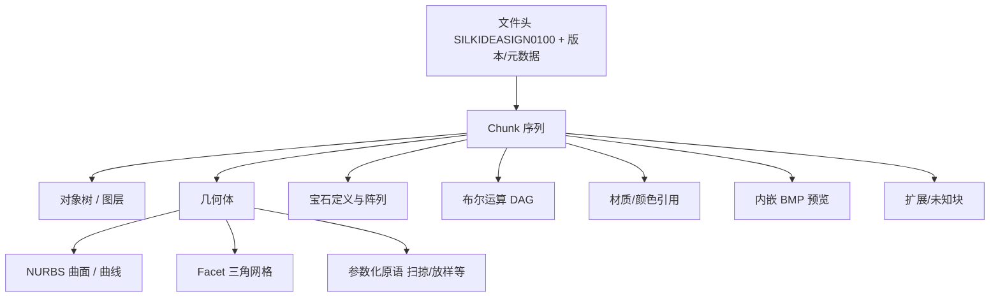
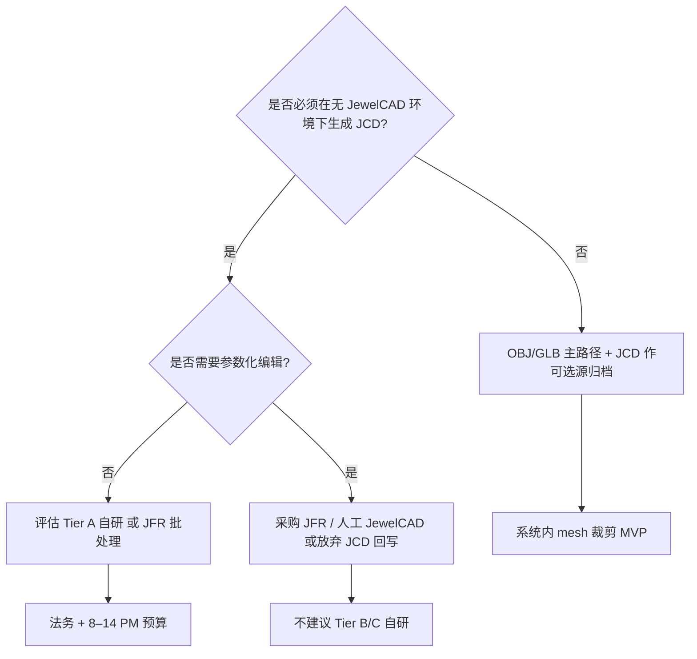

# 自研 JCD Writer 可行性、材料需求与工作量分析

**日期**: 2026-07-28  
**范围**: `3d_aigc_project` 镶嵌库与 JCD 相关管线  
**问题**: 若要将 AI 生成或网格编辑结果写回 JewelCAD 原生 `.jcd` 格式，自研 Writer 需要哪些材料、技术栈与人力投入？与现有替代方案相比是否值得立项？

---

## 1. 执行摘要

| 结论项 | 内容 |
|--------|------|
| **格式性质** | `.jcd` 为 SilkIdeaSign / JewelCAD 专有闭源格式，文件头多为 `SILKIDEASIGN0100:`（hex: `53 49 4C 4B 49 44 45 41 53 49 47 4E 30 31 30 30`），**无公开完整规范** |
| **现有逆向深度** | 本项目仅实现 **Reader 启发式子集**（点云 float32 扫描、内嵌 BMP 提取），**非结构化解析**，更无 Writer |
| **自研 Writer 最低可用** | Tier A「网格 Facet 封装」：约 **8–14 人月**（含调研 + POC + MVP + 生产化），且仅保证「JewelCAD 能打开、可见几何」，**不保留参数化历史** |
| **全兼容 JewelCAD** | Tier C 需复现 NURBS、宝石阵列、布尔树、材质与版本差异，估算 **36–60+ 人月**，接近重做 CAD 内核子集 |
| **推荐路径** | 业务上以 **OBJ/GLB 为 canonical mesh**；需回 JCD 时优先 **JewelCAD 官方导出** 或商业 **JFR（Jewelry For Rhino）** 插件，**不建议**在无商务授权与 JewelCAD 回归环境前大规模自研 Writer |

---

## 2. 背景：JCD 在本项目中的角色

### 2.1 业务上下文

镶嵌结构库约 **7,199** 个 JCD 逻辑记录（见 `docs/inlay-database-redesign.md`）。当前工作流：

- **入库**：用户上传 `.jcd`（可选附带 `.obj/.glb/.stl` 与预览图）
- **融合生成**：AI 管线消费 **mesh**（OBJ/GLB），不直接读 JCD 参数
- **JCD 价值**：JewelCAD 生态内的「源文件」归档、下游工厂/设计师在 CAD 中二次编辑

若未来需要「AI 生成结果一键回写 JCD」，则涉及 **Mesh → JCD Writer**，与现有 **JCD → Mesh Reader** 方向相反，难度高一个数量级。

### 2.2 现有 JCD 相关实现（Reader 侧）

| 组件 | 路径 | 能力 | 局限 |
|------|------|------|------|
| JCD → 点云/预览 | `scripts/generate_jcd_previews.py` | 识别 `SILKIDEASIGN0100:` / `SILKIDEASIGN` 头；滑动窗口扫描 float32 三元组；提取内嵌 BMP | 不解析 chunk/对象树；点云为启发式，易误匹配 |
| JCD → Mesh | `scripts/convert_jcd_to_mesh.py` | 点云 → Open3D Poisson 重建；可选四爪 proxy（已弃用于生产） | **非 CAD 几何**；小文件常失败 |
| 批量编排 | `scripts/convert_all_inlays.py` | scan / mesh / preview 三阶段 | mesh 阶段依赖上述启发式 |
| Worker | `scripts/inlay_worker.py` | 服务端 JCD→mesh 任务 | `allow_proxy=False` |
| 镶嵌导入 | `business-service/.../InlayItemCreateService.java` | 接受 `.jcd` 为 source | JCD 本身不参与 AI 推理 |

**Reader 已证实可提取的信息类型**（有限）：

1. 文件头 magic 字符串
2. 内嵌 Windows BMP（预览用，前 128KB 内 `BM` 签名）
3. 疑似 float32 顶点坐标块（通过 `_valid_triplet` + `_points_spread_ok` 过滤）
4. 伴生 `.bmp` 外部文件（非 JCD 内）

**Reader 未触及的 JCD 语义**（Writer 必须面对）：

- 二进制 chunk 类型与长度编码
- 参数化曲面（NURBS / B-spline）控制点与 knot 向量
- 宝石（尺寸、形状、阵列、镶口关系）
- 布尔运算树（并/差/交及历史）
- 对象图层、命名、材质引用（`.mat` 文件头 `SILKIDEAMATL0100`，TrID 数据库有记录）
- 单位、坐标系、版本号字段
- Facet 网格的正式存储结构（与启发式点云扫描不同）

### 2.3 既有调研结论（仓库内文档）

| 文档 | 相关结论 |
|------|----------|
| `docs/inlay-3d-preview-analysis.md` | JCD→mesh 为点云/Poisson 或历史 proxy，**不能**代表 CAD 真实造型；2D BMP 与 3D mesh 数据源割裂 |
| `docs/inlay-model-crop-integration-analysis.md` | **无法在 JCD 层面**做 CAD 级裁剪；可行路径为 OBJ 网格操作；「JCD 参数解析无公开 SDK，逆向仅点云，长期 ROI 不确定」 |
| `docs/inlay-database-redesign.md` | 战略上 **复用现有 convert 脚本**，不重写 JCD 解析；源 JCD 不可变，mesh 可版本化 |

### 2.4 Reader 实际成功率（量化参考）

基于 `scripts/regenerate_real_meshes_manifest.jsonl`（针对历史 proxy OBJ 的 Poisson 重建批次）：

| 指标 | 数值 |
|------|------|
| 尝试重建 | 6,371 |
| 成功（`pointcloud_poisson`） | 3,453（约 **54%**） |
| 失败（无可用点云） | 2,918（约 **46%**） |

说明：即便 **读** 方向，约半数 JCD（尤其小文件、配件类）无法提取足够点云；Writer 若不能通过 JewelCAD 全量回归，**无法**从 Reader 成功率推断 Writer 可靠性。

---

## 3. JCD 格式逆向：Writer 必须理解的结构

### 3.1 已知公开信息

| 来源 | 内容 | 可信度 |
|------|------|--------|
| TrID / 文件扩展名库 | 魔数 `SILKIDEASIGN0100`；材质文件 `SILKIDEAMATL0100` | 高（头签名） |
| filext.com 统计 | 约 95% JCD 为统一格式；常见 43KB–1MB，最大约 110MB；常含 `Gold` 等字符串 | 中（社区统计） |
| FileInfo / 厂商文档 | 仅 JewelCAD 可打开；可导出 STL（Misc → Cut in Slices → Also Output STL） | 高（用途） |
| 本项目 `.bak` 样例 | `docs/12件/戒指/戒指1/戒指1.bak` 以 `SILKIDEASIGN0100#` 开头 | 高（本地样本） |
| file-extensions.org「JCD structure」 | **实为 FlashGet 下载管理器格式**，与 JewelCAD **无关** | 需排除 |

**结论**：JewelCAD JCD **没有**可依赖的公开二进制规范；自研 Writer 必须 **自行逆向 + JewelCAD 回归测试**。

### 3.2 推断的格式层次（待验证）

Writer 至少需生成 **H + 最小合法 C 子集**；Tier 越高，需实现的块类型越多。

### 3.3 逆向方法论（Research 阶段标准动作）

1. **语料分层**：按文件大小（&lt;15KB / 15KB–1MB / &gt;1MB）、年代（2012 / 2020 / 2026）、品类（爪镶/戒圈/配件）分层抽样
2. **JewelCAD 可控实验**：在 CAD 内创建 **最简模型**（单球、单圆柱、单 Facet 立方体、单宝石），保存 JCD，做 **binary diff**
3. **Hex 结构分析**：识别 length-prefixed chunk、对齐 padding、字符串表（OleString 风格或 null-terminated）
4. **Round-trip 矩阵**：JCD → JewelCAD 打开 → 另存 → 对比 hash 与字段变化
5. **版本矩阵**：JewelCAD 5.x / Pro / 不同语言包；记录「最低可打开版本」
6. **与 STL/OBJ 导出对比**：同一模型 JCD 与 STL 顶点数、包围盒、体积关系

---

## 4. 自研 Writer 分级范围（Tier A / B / C）

### Tier A：Facet-only 封装（「能打开、看见网格」）

**目标**：将三角网格（OBJ/GLB/STL）烘焙为 JCD 内 Facet 对象，JewelCAD 可打开、可渲染；**不要求**参数编辑、宝石、布尔历史。

| 能力 | 说明 |
|------|------|
| 文件头与最小 chunk 骨架 | 合法 magic、必要元数据字段 |
| Facet 网格写入 | 顶点、面索引、法线（若格式要求） |
| 单对象/扁平场景 | 不含复杂对象树 |
| 内嵌 BMP 预览（可选） | 复用现有 BMP 提取逻辑的逆过程 |
| 默认材质/金属色 | 硬编码或模板复制 |

**不包含**：NURBS 重建、爪镶参数、戒圈号数、宝石库引用。

**典型用途**：AI 生成 mesh 归档为 JCD 供工厂「看一眼」；**不适合**在 CAD 中改爪位或改石径。

### Tier B：部分参数化（有限 CAD 语义）

**目标**：除 Facet 外，支持 **少量** JewelCAD 原生原语或参数块（如标准爪镶、座圈、宝石占位）。

| 额外能力 | 难度 |
|----------|------|
| 标准镶口模板参数（石径、爪数） | 高（需对齐 CAD 内核参数编码） |
| 简单 NURBS 曲面（扫掠/旋转） | 很高 |
| 布尔结果 **烘焙** 为 Facet（非可编辑布尔树） | 中 |
| 宝石实例（位置/尺寸，不含切工库全量） | 高 |

**典型用途**：常见爪镶/ bezel 类结构回写后可在 CAD 中 **有限度** 改参数。

### Tier C：JewelCAD 全兼容

**目标**：打开/编辑/再保存与原生 JewelCAD 等价；保留布尔历史、宝石阵列、曲面 Freespace 编辑能力。

| 维度 | 要求 |
|------|------|
| 全 chunk 类型 | 与厂商实现一致 |
| 版本前向/后向兼容 | 多版本 JewelCAD 回归 |
| 材质/宝石库 | 与 `.mat` 及内置库 ID 对齐 |
| 性能 | 大场景（&gt;1MB JCD）读写 |

**评估**：实质为 **专有 CAD 文件格式完整实现**，除非有格式授权或厂商合作，**不建议**作为应用团队 side project。

---

## 5. 所需参考材料清单

### 5.1 技术材料（必备）

| 类别 | 具体内容 | 用途 |
|------|----------|------|
| **JCD 语料库** | 本项目 `镶嵌结构数据库/` 全量 ~7,199 文件 + 按 tier 人工标注子集 200–500 | 统计 chunk、回归测试 |
| **可控金样例** | 10–30 个 JewelCAD 内从零保存的最简 JCD（每类几何 1 个） | diff 逆向 |
| **JewelCAD 许可证环境** | 至少 1 套 Windows + JewelCAD（已知版本号） | 打开/保存验证 |
| **Hex / diff 工具链** | `010 Editor`、BinDiff、自研 Python chunk 探针 | 结构分析 |
| **Round-trip 基线** | 同一设计：JCD ↔ STL/OBJ 官方导出对 | 几何一致性 |
| **现有 Reader 代码** | `generate_jcd_previews.py`、`convert_jcd_to_mesh.py` | 避免重复劳动；验证 float 块假设 |

### 5.2 业务与法务材料

| 类别 | 说明 |
|------|------|
| **IP / 逆向合规意见** | JCD 为香港 SilkIdeaSign 专有格式；需确认逆向 **互操作性** 在司法辖区是否可接受；是否需厂商授权 |
| **用户许可** | 语料库 JCD 是否允许用于格式逆向与自动化测试 |
| **下游兼容性需求** | 工厂/设计师使用的 JewelCAD **最低版本**（决定测试矩阵） |

### 5.3 可选外部参考

| 来源 | 价值 | 限制 |
|------|------|------|
| **JFR（Jewelry For Rhino）** | 宣称可读写的 JCD；有 `Save Jewelcad File` 工具 | 商业闭源；不可直接反编译依赖；可作 **行为对标** |
| **convert.guru 等在线转换** | 有限 metadata 探测 | 非 Writer API；成功率不透明 |
| **Rhino + JFR 插件文档** | [LINGXI JFR Tools Manual](https://doc.lingxi3d.com/en/Tool) | 产品能力描述，非格式规范 |

---

## 6. 技术栈建议

| 阶段 | 推荐栈 | 理由 |
|------|--------|------|
| Research / POC | **Python 3.11+**（`struct`、`numpy`、现有 scripts） | 与仓库一致；迭代快 |
| 生产 Writer 核心 | **C++17** 或 **Rust** | 二进制精度、大文件性能、嵌入 business/ai pipeline |
| 网格输入 | **trimesh / Open3D**（已有） | Tier A 读 OBJ/GLB |
| Tier B+ 曲面 | **Open CASCADE (OCCT)** | NURBS 与布尔；学习曲线陡 |
| 测试 | **pytest** + JewelCAD CLI/自动化（若有）+ manifest jsonl | 对齐现有 `*_manifest.jsonl` 模式 |
| CI | Windows runner + JewelCAD（或人工 gated release） | 格式验证强依赖原生 CAD |

**不建议**在 Tier A 未稳定前引入 OCCT 全量集成；Tier A 可尝试 **模板克隆法**（复制结构相似的空 JCD 骨架，仅替换 Facet 字节区）。

---

## 7. 工作量估算（人月 PM）

> 1 PM = 1 全职工程师 × 1 月；含开发、自测，**不含**法务流程与 JewelCAD 采购周期。  
> 假设团队具备：二进制协议、计算几何基础；**至少 0.5 PM** 兼职熟悉 JewelCAD 的珠宝 CAD 用户做验收。

### 7.1 分阶段（以 Tier A 为主线）

| 阶段 | 主要交付 | Tier A | Tier B 增量 | Tier C 增量 |
|------|----------|--------|-------------|-------------|
| **R1 调研** | Chunk 地图 v0、最简 JCD  diff 报告、版本矩阵 | 2–3 PM | +1–2 PM | +3–5 PM |
| **R2 POC** | 单 mesh → 1 个 JCD 被 JewelCAD 打开；自动化 hex 校验 | 1.5–2.5 PM | +2–3 PM | +6–10 PM |
| **R3 MVP** | 批量 Writer CLI、BMP 嵌入、50–100 样本回归、失败分类 | 2–3 PM | +3–5 PM | +10–15 PM |
| **R4 生产** | API 集成、监控、与镶嵌库回写、文档、运维 | 1.5–2.5 PM | +2–4 PM | +8–12 PM |
| **持续维护** | 每 JewelCAD 大版本 | 0.5 PM/年 | 1 PM/年 | 2–4 PM/年 |
| **合计** | | **8–14 PM** | **+16–26 PM**（累计 24–40 PM） | **+36–60+ PM**（累计 60–100+ PM） |

### 7.2 团队技能配置

| 角色 | Tier A | Tier B/C |
|------|--------|----------|
|  senior 二进制/图形工程师 ×1 | 必需 | 必需 |
|  计算几何（NURBS/布尔）×0.5–1 | — | 必需 |
|  JewelCAD 领域专家 ×0.3 | 验收 | 共建金样例 |
|  QA / 测试工程师 ×0.3 | 回归矩阵 | 扩展版本矩阵 |
|  法务顾问 | 评审 | 评审 |

### 7.3 与本项目其他工作的对比

| 项目 | 估算 | 说明 |
|------|------|------|
| 镶嵌库网格内裁剪 MVP | 1–2 PM | `docs/inlay-model-crop-integration-analysis.md` |
| JCD Reader 改进（真实 mesh 覆盖率） | 2–4 PM | Poisson + 分类，非 Writer |
| **Tier A JCD Writer** | 8–14 PM | 约为裁剪 MVP 的 **4–7 倍** |
| **Tier C 全兼容** | 60–100+ PM | 接近独立产品 |

---

## 8. 风险 register

| 风险 | 等级 | 说明 | 缓解 |
|------|------|------|------|
| **格式不透明** | 高 | 无官方 spec；chunk 可能加密或校验和 | 模板克隆 + 金样例 diff；分阶段交付 |
| **版本碎片化** | 高 | `SILKIDEASIGN0100` 后字段随版本变 | 明确支持版本上限；文件头版本字段 |
| **Legal / IP** | 高 | 专有格式逆向可能触发许可争议 | 立项前法务书面意见；优先官方/JFR 路线 |
| **几何 fidelity** | 高 | Tier A 仅 Facet；CAD 中不可参数编辑 | 产品明确「归档/预览」定位 |
| **Round-trip 失败** | 中 | Writer 产出被 JewelCAD 静默损坏 | 打开 + 另存 + 体积/顶点对比自动化 |
| **测试矩阵成本** | 中 | 7,199 文件 × 多版本 | 分层抽样 + 失败聚类，不全量阻塞 |
| **维护负担** | 中 | JewelCAD 升级破坏兼容 | 固定目标版本；版本探测与降级提示 |
| **Reader 无法验证 Writer** | 中 | 现有 Reader 不解析 Facet 块 | Writer 需独立验证链路 |
| **组织依赖** | 中 | 强依赖 Windows + JewelCAD 许可 | 专用 VM；JFR 作第二验证源 |

---

## 9. 方案对比：自研 Writer vs 替代路径

| 方案 | 能力 | 成本 | 周期 | 适合场景 |
|------|------|------|------|----------|
| **A. 保持 OBJ/GLB 为 canonical** | AI 融合、3D 预览、工厂 STL 链路 | 低（已实现） | 0 | **当前主路径**；镶嵌库已支持 OBJ 直传 |
| **B. JewelCAD 人工/半自动导出** | 用户 CAD 内裁剪后导出 OBJ；JCD 仅归档 | 低 | 流程 | `inlay-model-crop-integration-analysis.md` 推荐中间方案 |
| **C. JewelCAD 批量自动化** | 若存在脚本/COM/API 监听文件夹 | 中 | 1–2 PM 调研 | 减少人工重复 |
| **D. JFR（Jewelry For Rhino）** | Rhino 内打开/保存 JCD；宣称保留宝石与布尔 | **商业许可**（灵犀 3D 插件） | 采购 + 集成 1–3 PM | 需 **Rhino + JFR**；mesh→JCD 可在 Rhino 内完成再 Save JCD |
| **E. 自研 Tier A Writer** | 程序化 mesh→JCD | 8–14 PM + 法务 | 6–12 月 | 必须 **零 JewelCAD 依赖** 的归档（罕见） |
| **F. 自研 Tier C Writer** | 全兼容 | 60–100+ PM | 2–4 年 | **不推荐** |
| **G. 商业转换 SaaS** | convert.guru 等 | 按量/不可控 | — | 批量自动化弱；数据出境 |

### 9.1 针对本项目的推荐决策树

**综合建议**：

1. **AI 生成与镶嵌融合**：继续以 **mesh** 为唯一几何真理来源（与 `GenerateService.resolveInlayMeshPath()` 一致）。
2. **员工完整模型预裁剪**：优先 **OBJ 系统内分量编辑**（1–2 PM），而非 JCD Writer。
3. **若业务强制要求 JCD 交付物**：优先 **Rhino + JFR Save JCD** 或 **JewelCAD 官方导出**，自研仅作 **Tier A 归档** 且需法务绿灯。

---

## 10. 若仍立项 Tier A：建议里程碑

| 里程碑 | 验收标准 | 周期 |
|--------|----------|------|
| M0 法务 + 环境 | 书面意见；JewelCAD VM 就绪 | 2–4 周 |
| M1 Chunk 地图 v0 | 5 类最简金样例 diff 文档 | 4–6 周 |
| M2 POC | 1 个 OBJ → JCD，JewelCAD 无报错打开 | 4 周 |
| M3 MVP | CLI 批量 100 文件；成功率 &gt;90%（打开）；几何 bbox 误差 &lt;1% | 8 周 |
| M4 集成 | `POST /api/inlay/.../export-jcd` 或离线 worker；manifest 日志 | 4–6 周 |

**明确不做（MVP 范围外）**：参数化爪镶、宝石库、布尔树、JCD 内裁剪、与 Reader 双向同步。

---

## 11. 关键代码与文档索引

| 类型 | 路径 |
|------|------|
| JCD 点云/BMP Reader | `scripts/generate_jcd_previews.py` |
| JCD → Mesh | `scripts/convert_jcd_to_mesh.py` |
| 批量编排 | `scripts/convert_all_inlays.py` |
| Mesh 重建批次 | `scripts/regenerate_real_meshes.py` |
| 镶嵌 Worker | `scripts/inlay_worker.py` |
| 3D 预览根因 | `docs/inlay-3d-preview-analysis.md` |
| 系统内裁剪 | `docs/inlay-model-crop-integration-analysis.md` |
| 镶嵌库 redesign | `docs/inlay-database-redesign.md` |
| JCD 头样例 | `docs/12件/戒指/戒指1/戒指1.bak` |

---

## 12. 结论

1. **自研 JCD Writer 技术上可行，但仅 Tier A（Facet 封装）具备可控 ROI**；完整 JewelCAD 兼容（Tier C）成本接近独立 CAD 产品，与当前 AI 珠宝生成项目目标不匹配。  
2. **材料上最缺的不是代码而是**：JewelCAD 回归环境、可控金样例、法务意见、以及 **chunk 级二进制规范**（现为零）。  
3. **工作量**：Tier A 约 **8–14 人月**；Tier B **24–40 人月**；Tier C **60–100+ 人月**。  
4. **对比替代方案**：本项目已具备 OBJ/GLB 全链路；JCD 回写应优先 **JewelCAD / JFR 商业路径**，自研 Writer 仅建议在「无法依赖 CAD 许可 + 仅需归档级 Facet JCD + 法务通过」三者同时满足时立项。

---

*文档基于 2026-07-28 仓库代码与 manifest 统计；JewelCAD 版本与 JFR 定价以实际采购为准。*
