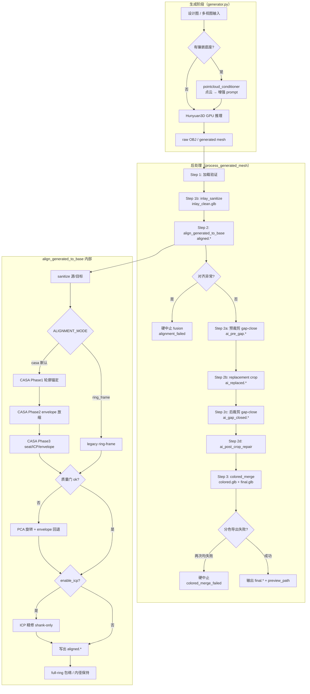
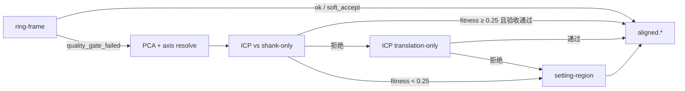

# 镶嵌对齐算法执行流程概览（CASA 默认 + ring-frame legacy）

> 本文档描述当前代码中的镶嵌替换对齐管线。**默认主路径为 CASA**（Contour-Anchored Scale-decoupled Alignment）；`ALIGNMENT_MODE=ring_frame` 可回退旧 ring-frame 行为。
>
> - `ai-service/app/services/mesh_processor.py`
> - `ai-service/app/services/generator.py`
> - `ai-service/app/services/pointcloud_conditioner.py`（仅生成阶段 prompt 条件，不参与几何对齐）

---

## 1. 总体目标

在 **轨道 A（设计图 + 镶嵌底座 → 3D 模型）** 中，AI 生成的通常是 **整枚戒指/珠宝主体**（归一化或近似单位尺度）。CAD 镶嵌底座来自标准库，带有精确的戒圈、镶口与爪位。

**替换模式** 的目标：

1. 将 AI 主体 **刚性对齐** 到 CAD 镶嵌底座的坐标系（尺度、戒圈轴、镶口朝向）。
2. **裁切** AI 与镶嵌重叠区域（避免爪位/镶口双重几何）。
3. **闭合** 接触面间隙，使预览中橙（镶嵌）/蓝（AI）区域贴合。
4. **分色合并** 导出双网格预览（`colored.glb` / `final.glb`），而非布尔并集单网格。

AI **不重复生成** 爪位与镶口细节；底座由库提供，AI 只生成与之衔接的主体与装饰结构。

---

## 2. 端到端流程图



---

## 3. 任务进度与触发条件（generator.py）

| 进度 | current_step | 说明 |
|------|--------------|------|
| 15% | 准备镶嵌条件 | 有 `setting_mesh_path` 时：`pointcloud_conditioner` 采样底座 → 增强 prompt |
| 10% | 加载模型 | Hunyuan3D 权重加载 |
| 20% | 3D模型生成中 | GPU 推理 |
| 70% | 后处理 | 推理完成 |
| 75% | ICP对齐与分色合并 | `enable_mesh_fusion=true` 且提供底座时调用 `process_generated_mesh` |
| 95% | 保存结果 | 写出 `output_path` / `preview_path` |

**融合触发条件：**

- `setting_mesh_path` 存在且 `enable_mesh_fusion != false`
- 默认 `fusion_method = "colored_merge"`
- 默认 `enable_icp_alignment = true`（对齐阶段 ICP 精修）

独立融合任务（`_process_mesh_fusion`）同样统一走 `process_generated_mesh`，进度步为「网格融合与后处理」。

---

## 4. 各阶段步骤说明

### Step 0 — 生成前条件（非几何对齐）

**文件：** `pointcloud_conditioner.py` + `generator._prepare_track_a_prompt`

- 将镶嵌底座 mesh 均匀采样为点云（默认 2048 点）。
- 估计 `bbox`、`center`，写入 prompt 增强参数。
- **仅影响 AI 生成内容与尺度倾向**，不参与后续 ICP/ring-frame 数值计算。

---

### Step 1 — 网格加载验证

- 确认 `generated_mesh_path` 存在。
- 融合阶段优先使用 **raw OBJ**（`gen_result.raw_path`），避免 STL 往返导致 Open3D 写出空网格。

---

### Step 1b — 镶嵌底座清洗（`inlay_sanitize`）

**函数：** `sanitize_mesh` → 产物 `{task_id}/inlay_clean.glb`

1. `_filter_junk_components`：去除 CAD 导出中的碎屑、辅助体。
2. `_select_primary_assembly`：保留空间上主装配（去除正交多视图副本等）。
3. 失败时回退使用原始 `base_mesh_path`，不中断流程。

---

### Step 2 — 对齐（`mesh_alignment`）

**函数：** `align_generated_to_base` → 产物 `{task_id}/aligned.{fmt}`

#### 2.1 内部预处理（sanitize）

- 优先使用 Step 1b 的 `cleaned_base_path`；否则在内存中对底座做 junk 过滤 + 主装配选择。
- 对 AI 源网格同样 `_filter_junk_components` 去除浮游小片。
- 导出临时 shank-only 网格供 ICP 精修（避免锁定爪位）。

#### 2.2 主路径：CASA 对齐（默认）

**函数：** `_compute_casa_alignment_transform`  
**配置：** `ALIGNMENT_MODE=casa`（默认），见 [第 5 节](#5-casa-轮廓锚定--解耦放缩对齐)。

三阶段解耦：

1. **Phase1 轮廓锚定**：AI 归一化到单位戒圈直径 → 角向 envelope 互相关 + setting 角向锚点 → 刚性姿态（无 scale）
2. **Phase2 解耦放缩**：inlay 尺寸锁定；按扇区 `(inner_r - clearance) / outer_r` 中位数估计 uniform scale（不再 clip 0.98–1.15）
3. **Phase3 精细对齐**：复用 seat shift、micro search、full-ring envelope、ICP；**默认关闭** ambiguous soft_accept

失败时回退 **`casa_pca_fallback`**：PCA 仅旋转 + envelope scale（不用 AABB scale）。

#### 2.3 Legacy 主路径：ring-frame 对齐

**函数：** `_compute_ring_alignment_transform`  
**配置：** `ALIGNMENT_MODE=ring_frame`

详见 [第 6 节](#6-ring-frame-对齐思路legacy)。

- 若 `ring_info.ok == true` 或 `ring_info.soft_accept == true` → 采用 ring-frame 变换
- 否则进入 PCA/ICP 回退（AABB scale）

#### 2.4 回退路径：PCA → ICP → setting-region

**仅在 ring-frame 未接受时执行：**

| 子步骤 | 函数 | 说明 |
|--------|------|------|
| PCA 刚性对齐 | `_compute_pca_alignment_transform` | 主成分轴 + AABB IoU 选最优符号翻转；统一尺度 |
| 轴歧义消解 | `_fix_alignment_axis_ambiguity` | 0°/180°（±90°）半圈搜索，使镶口朝向匹配 |
| ICP 精修 | `icp_align`（对 **shank-only** 目标） | Point-to-Plane ICP；`fitness ≥ 0.25` 才考虑 |
| ICP 验收 | 内置质量门 | 戒圈 proximity 改善、setting 不恶化、up 不翻转、轴角 ≤ 30° |
| ICP 仅平移 | 同上 | 旋转破坏 seating 时，仅采纳 ICP 平移分量 |
| setting-region | `_compute_setting_region_transform` | ICP fitness 过低或 ICP 异常时的最后回退 |

Ring-frame **已成功** 时，ICP 精修仍可能运行（对 pre-ICP 姿态做 shank 微调），但验收更严，恶化则保留 ring-frame 结果。

#### 2.4 后处理（对齐输出）

- Full-ring 模式：`band_limited_radial_scale` + `_preserve_ring_bore_radius` 保持内径/contact。
- 写出 `aligned.*`；输出无效或 0 顶点 → **抛异常**。

---

### Step 2a — 预裁剪间隙闭合（`interface_gap_close_pre`）

**条件：** 非 full-ring，且 `setting_median > diameter × 0.028`

**函数：** `close_ai_inlay_interface_gap` → `ai_pre_gap.{fmt}`

在对 replacement crop 之前，先把 AI 接触带顶点向镶嵌内表面推移，避免对齐后镶口留缝过大。

---

### Step 2b — 替换裁剪（`inlay_replacement_crop`）

**函数：** `crop_overlapping_ai_body` → `ai_replaced.{fmt}`

- KDTree 近邻：移除 AI 面片中与 **setting/爪位** 重合的部分。
- 若 Step 2a 已成功或 full-ring 模式 → `overlap_only=true`，仅剥薄双重表皮，不重新打开 seat gap。
- 裁剪过多（保留面 < 12%）→ 跳过裁剪，保留对齐后 AI。

---

### Step 2c — 后裁剪间隙闭合（`interface_gap_close`）

**函数：** `close_ai_inlay_interface_gap` → `ai_gap_closed.{fmt}`

- Full-ring 或 pre-gap 已足够贴合时 **跳过**。
- 否则在 crop 后再次局部非刚性推近接触面。

---

### Step 2d — 裁剪后轻量修复（`ai_post_crop_repair`）

**函数：** `repair_ai_after_crop`

- 退化面/尖刺清理 + 裁剪边界 Taubin 平滑。
- 若修复后面数损失 > 12% → **回退** 到裁剪后网格，避免破坏戒圈贴合。

---

### Step 3 — 分色合并（`colored_merge`）

**函数：** `export_colored_dual_mesh`

| 角色 | 颜色（RGBA） |
|------|----------------|
| 镶嵌底座 | 琥珀 `(230, 162, 60)` |
| AI 主体 | 蓝色 `(64, 158, 255)` |

- Full-ring 模式可先 `_apply_full_ring_preview_cover` 避免 z-fighting。
- 产物：
  - `{task_id}/colored.glb` — 分色 Scene
  - `{task_id}/final.glb` — 预览副本（分色路径固定 GLB，即使用户请求 STL/OBJ 下载格式）
- 首次导出失败 → **一次** `colored_merge_retry`（用 `aligned_mesh_path` 重试）。
- 两次均失败 → **硬中止**，`success=false`；可能降级写出 `merged.*` 供下载，但不静默回退到未对齐灰模。

---

### Step 4–6 — 拓扑修复与 final 写出

- **分色成功时跳过整模拓扑修复**（避免 concatenate 冲掉分区颜色）。
- 非分色路径或 boolean 融合才走 `repair_mesh`。
- 下载文件：`final.{user_fmt}`；分色预览：`preview_path` → `final.glb`。

---

## 5. CASA 轮廓锚定 + 解耦放缩对齐

**核心函数：** `_compute_casa_alignment_transform`  
**辅助：** `_compute_contour_anchored_pose`、`_compute_casa_envelope_scale`、`_angular_profile_cross_correlation`

### 5.1 动机

旧 ring-frame 将 **scale 与 360° 姿态搜索耦合**，且 `scale_contact` 限幅 [0.98, 1.15]，在 AI 初始尺度与 CAD inlay 相差过大时：

- AI 过小：小环在大孔内 shank 距离平坦 → **任意 roll 角均可成为最优**
- AI 过大：ring 路径 scale 不足 → envelope 最多再缩 12% → **镶口错位或 soft_accept 误过**

CASA 将 **轮廓定姿** 与 **envelope 定标** 分离；inlay 刚性锁定，仅 AI 整体放缩。

### 5.2 Phase1 — 轮廓锚定（scale-invariant）

| 步骤 | 函数 | 说明 |
|------|------|------|
| 戒圈系 | `_estimate_ring_frame` | 双方 score < 0.28 → 失败 |
| 归一化 | `_normalize_mesh_to_unit_ring` | AI 缩至直径 1.0（仅搜索用） |
| 互相关 | `_angular_profile_cross_correlation` | 36 扇区 inner/outer profile 归一化互相关 → roll 角 |
| Setting 锚 | `_estimate_setting_angular_anchor` | inlay prong vs AI head 角向差 → roll hint |
| 融合 | `_compute_contour_anchored_pose` | 加权融合 roll；`_resolve_ring_axis_half_turn` 消歧 |
| 退化检测 | `peak_ratio` + `pose_confidence` | 互相关平坦且 setting 锚弱 → `ambiguous_pose` |

### 5.3 Phase2 — envelope 解耦放缩

```
ratio[b] = (inner_r[b] - clearance) / outer_r[b]
s = median(ratio)   # 或 std 过大时用 percentile(ratio, 25)
s ∈ [CASA_SCALE_MIN, CASA_SCALE_MAX]  # 默认 0.05 ~ 50
```

替换 ring-frame 的 `scale_base × scale_contact`；扇区不足时回退 `diameter_ratio`。

### 5.4 Phase3 — 精细对齐（复用）

- `_refine_seating_micro_search`、full-ring `_refine_full_ring_envelope_alignment`
- **`_refine_alignment_inlay_overlap`**：尺度 × 平移迭代搜索，最大化 inlay 采样点落在 AI 体内的比例
- ICP shank-only（`enable_icp_alignment=true` 时）
- 质量门：与 ring-frame 类似，但 **ambiguous_pose 且 pose_confidence 低时拒绝**；`CASA_SOFT_ACCEPT=false` 默认
- **98% 体积重合硬门控**（见 [5.7](#57-98-体积重合硬门控)）

### 5.5 配置项

| 环境变量 | 默认 | 说明 |
|----------|------|------|
| `ALIGNMENT_MODE` | `casa` | `casa` 或 `ring_frame` |
| `CASA_SOFT_ACCEPT` | `false` | 是否允许 CASA soft_accept |
| `CASA_MIN_PEAK_RATIO` | `0.15` | 互相关峰值尖锐度阈值 |
| `CASA_MIN_INLAY_OVERLAP_RATIO` | `0.98` | 镶嵌 shank（或 full-ring 整模）采样点落在 AI 体内的最低比例 |

### 5.6 回归测试

合成 torus 戒圈：`ai-service/tests/test_casa_alignment.py`（0.2× / 4× 尺度 + roll 角 + 98% overlap gate）。

### 5.7 98% 体积重合硬门控

**动机：** 仅靠 shank 表面距离 / 直径比无法阻止「AI 与琥珀底座完全分离」的灾难性错位（尺度或平移错误仍可能 soft-pass）。

**指标 `_compute_inlay_ai_overlap_ratio`：**

1. 在镶嵌 **shank 内壁接触带** 均匀采样（默认 6000 点；有 ring frame 时用 `_sample_inlay_inner_wall_points`，排除爪位）。
2. 对每个采样点判断是否与 AI mesh 重合：
   - 优先 `trimesh.contains`（水密 mesh）；
   - 否则 `ProximityQuery.on_surface` 距离 ≤ 容差（≈ `max(diameter×1.8%, 0.10mm)`）。
3. **overlap_ratio = 重合点数 / 采样点数**（体内 + 接触面均计为重合）。

**Enforcement 时机：**

| 阶段 | 行为 |
|------|------|
| CASA Phase2 | `_pick_casa_scale_by_overlap` 在 envelope / ring-frame 多个 scale 候选中选 overlap 最高者 |
| CASA Phase3 末 | `_refine_alignment_inlay_overlap` 尺度 0.5–2× + 轴向平移搜索 |
| CASA 质量门 | `overlap_ratio >= 0.98` 否则 `reason=inlay_overlap_gate_failed` |
| `align_generated_to_base` 末 | ICP / bore 编辑后再次 refine；仍 < 98% → **`ValueError` 硬中止**（`alignment_failed`） |

**失败时不静默输出错误预览**；需重新生成或检查镶嵌库尺度 / AI 输出。

---

## 6. ring-frame 对齐思路（legacy）

**核心函数：** `_compute_ring_alignment_transform`

### 6.1 戒圈坐标系估计

对 AI 主体与镶嵌 **shank（最大连通分量）** 分别调用 `_estimate_ring_frame`：

- 估计 **戒圈轴**（torus axis，手指方向）、**孔心**、**中位半径/直径**。
- 输出 **ring-likeness score**；双方 score < 0.28 → ring-frame 不可用。

### 6.2 拆分 shank / setting

- `_split_shank_and_setting`：最大分量 = 戒圈；其余 = 镶口/爪位。
- **setting up** 方向：优先 `_geometric_setting_up`（孔心 → setting 质心）；否则 `_detect_setting_up`（角向密度启发式）。

### 6.3 尺度

- `scale_base = tgt_diameter / src_diameter`（按 **戒圈直径**，非整体 AABB）。
- `scale_contact`：根据镶嵌内径与 AI 外径接触关系微调（clip 0.98–1.15）。
- **无 prescale 预缩放步骤**（见 [第 10 节](#10-已回退移除的项)）。

### 6.4 姿态搜索

- 枚举：`up_flip` × `axis_sign` × `angle_steps`（默认 36 步，每步 10°）。
- 对每个候选 4×4 变换，`_score_ring_alignment_pose` 评分（shank + setting 距离）。
- `_resolve_ring_axis_half_turn`：额外 0°/180° 消解头/戒圈颠倒。
- **Fine seat**：沿 up 平移使 AI 头部接近 setting tip（有上限，且不恶化 band）。
- `_refine_seating_micro_search`：微调就座。

### 6.5 Full-ring 包络

- `_detect_full_ring_inlay_mode` 识别整圈镶嵌。
- `_refine_full_ring_envelope_alignment` + 后续 `_apply_band_limited_radial_scale` 控制 angular gap。

### 6.6 soft_accept 含义

ring-frame 有两档质量门：

**严格通过（`ok`）：**

- 轴角 ≤ 25°
- 直径比 ∈ [0.7, 1.35]
- shank 中位距离 ≤ diameter × 0.20
- annular gap / max protrusion 在阈值内
- 有 setting 时 `up_cos ≥ 0.25`

**软通过（`soft_accept`）：** 未达严格标准，但：

- 轴角仍 ≤ 25°
- 直径比 ∈ [0.65, 1.45]
- 有 setting 时 `up_cos ≥ 0.40`

软通过仍 **采用 ring-frame 变换**（不进入 PCA 回退），但 `reason = quality_gate_soft_accept`，日志中会标注。两者均失败则 `quality_gate_failed`，变换 discarded，走 PCA 回退。

---

## 7. PCA / ICP 回退路径



**ICP 细节（`icp_align`）：**

- 表面均匀采样 5000 点；Point-to-Plane。
- 对应距离自适应：`max(tgt_extent × 0.08, 0.05)`。
- 精修目标为 **shank 临时网格**，避免 ICP 吸附爪位导致头部翻转。

**注意：** PCA/ICP 是 ring-frame 失败后的 **基础回退**，仍在当前版本中；与已移除的「增强型多轮 PCA 优化」不同（见第 10 节）。

---

## 8. 质量门控与失败行为

| 场景 | 行为 |
|------|------|
| `align_generated_to_base` 抛异常（空网格、无效输出等） | `process_generated_mesh` **立即返回** `alignment_failed`，**不继续** crop/merge |
| CASA ambiguous_pose | **回退** PCA 旋转 + envelope scale |
| CASA inlay overlap < 98% | **回退** 或 **硬中止**（`inlay_overlap_gate_failed` / `alignment_failed`） |
| ring-frame 质量门失败 | **回退** PCA/ICP，不中止 |
| 对齐完成但 `final_quality` 差（轴角 > 35° 等） | 记录 `quality_warning`，**仍继续** 后续 crop/merge |
| `colored_merge` 两次导出均失败 | **硬中止** `colored_merge_failed` |
| 融合整体失败 | `generator` 记录 warning；任务可能仍返回生成 mesh，但 **无分色预览** |

**设计原则：** 对齐阶段 **异常即硬中止**；质量警告 **不阻断** 替换流程；分色合并 **不允许** 静默回退到未对齐灰模。

---

## 9. 关键函数对照表

| 阶段 | 函数 | 文件 |
|------|------|------|
| Prompt 点云条件 | `PointCloudConditioner.build_condition_features` | `pointcloud_conditioner.py` |
| 任务编排 / 融合入口 | `GeneratorService` 生成流程、`process_generated_mesh` 调用 | `generator.py` |
| 主后处理管线 | `MeshProcessor.process_generated_mesh` | `mesh_processor.py` |
| 底座清洗 | `sanitize_mesh` | `mesh_processor.py` |
| 对齐总入口 | `align_generated_to_base` | `mesh_processor.py` |
| CASA 主路径 | `_compute_casa_alignment_transform` | `mesh_processor.py` |
| 轮廓锚定 | `_compute_contour_anchored_pose` | `mesh_processor.py` |
| Envelope 放缩 | `_compute_casa_envelope_scale` | `mesh_processor.py` |
| 角向互相关 | `_angular_profile_cross_correlation` | `mesh_processor.py` |
| Ring-frame (legacy) | `_compute_ring_alignment_transform` | `mesh_processor.py` |
| 戒圈系估计 | `_estimate_ring_frame` | `mesh_processor.py` |
| Setting 朝向 | `_geometric_setting_up`, `_detect_setting_up` | `mesh_processor.py` |
| PCA 回退 | `_compute_pca_alignment_transform` | `mesh_processor.py` |
| 轴歧义 | `_fix_alignment_axis_ambiguity`, `_resolve_ring_axis_half_turn` | `mesh_processor.py` |
| ICP | `icp_align` | `mesh_processor.py` |
| Setting 区域回退 | `_compute_setting_region_transform` | `mesh_processor.py` |
| 预/后 gap-close | `close_ai_inlay_interface_gap` | `mesh_processor.py` |
| 替换裁剪 | `crop_overlapping_ai_body` | `mesh_processor.py` |
| 裁剪后修复 | `repair_ai_after_crop` | `mesh_processor.py` |
| 分色导出 | `export_colored_dual_mesh` | `mesh_processor.py` |
| 输出路径 | `generate_output_path(output_dir, task_id, filename)` | `app/utils/file_utils.py` |

---

## 10. 产物文件命名

所有产物位于 `{output_dir}/{task_id}/`：

| 文件名 | 阶段 | 说明 |
|--------|------|------|
| `inlay_clean.glb` | sanitize | 清洗后镶嵌底座 |
| `aligned.{fmt}` | alignment | 对齐后 AI 主体（`fmt` = 用户 `result_format`，默认 glb） |
| `ai_pre_gap.{fmt}` | gap-close (pre) | 预裁剪前间隙闭合（可选） |
| `ai_replaced.{fmt}` | crop | 替换裁剪后 AI |
| `ai_gap_closed.{fmt}` | gap-close (post) | 裁剪后间隙闭合（可选） |
| `ai_repaired.{fmt}` | repair | 裁剪后轻量修复（可选） |
| `ai_preview_cover.glb` | full-ring cover | 整圈预览防 z-fighting（可选） |
| `colored.glb` | colored_merge | 分色双网格 Scene |
| `final.glb` | final | 分色预览（固定 GLB） |
| `final.{fmt}` | final | 用户下载格式（可能与 preview 相同或另导） |
| `merged.{fmt}` | fallback | 分色失败时的对齐双网格下载兜底 |

临时文件（对齐过程中，完成后删除）：`*.src_clean.tmp.glb`、`.pre_icp.tmp.glb`、`.shank.tmp.glb` 等。

---

## 11. 已回退移除的项

以下能力在 **当前版本代码中不存在**（回滚后已去除），阅读旧文档或 PR 时请勿假定仍存在：

| 项 | 说明 |
|----|------|
| **prescale / 预缩放** | 对齐前无独立 prescale 步骤；尺度在 ring-frame（直径比）或 PCA（AABB extent）内联完成 |
| **对齐多轮 retry** | 无「对齐失败 → 换参重试 → 再对齐」的外层循环；ring-frame 一次 + 最多一条 PCA/ICP 回退链 |
| **增强型 PCA 多_pass 优化** | 无额外 prescale-PCA 级联或多次 PCA 迭代；仅单次 `_compute_pca_alignment_transform` |
| **对齐失败自动降级融合** | 对齐异常即 abort；分色失败不静默合并未对齐灰模 |

**仍保留（请勿与上表混淆）：**

- ring-frame 失败后的 **基础 PCA → ICP → setting-region 回退链**
- `colored_merge` 导出失败时的 **单次 export retry**（非对齐 retry）

---

## 12. 已知限制与注意点

### 12.1 AI 整戒生成

- 模型常输出 **完整戒圈 + 戒头**，而非仅装饰主体；依赖 crop 去除与镶嵌重叠的 setting 区域。
- Prompt 已要求「不要重复爪位/镶口」，但几何上仍可能含冗余 shank，靠对齐 + 裁剪处理。

### 12.2 尺度

- AI mesh 常为 **归一化/单位球** 尺度；CASA 用 envelope median scale 拉齐到 CAD 毫米级（默认允许 0.05×~50×）。
- ring-frame legacy 仍用直径比 + 窄带 contact clip。
- 极端 scale 会打 warning；CASA 下超出 `casa_scale_max/min` 且未开 soft_accept 时 **拒绝 CASA 路径** 并回退。

### 12.3 Ring-frame / CASA 适用性

- 非标准戒圈（耳钉、吊坠、严重非旋转对称）ring score 可能过低，频繁走 PCA 回退，精度下降。
- Full-ring 与普通镶口模式的 gap / crop / envelope 分支不同，需整圈 CAD 才能走 envelope 管线。

### 12.4 GPU 与后处理耗时

- **GPU 推理** 与 **CPU 后处理** 分离：对齐/crop/merge 在 `asyncio.to_thread` 中 CPU 运行。
- Open3D ICP、scipy KDTree、trimesh 操作在复杂 mesh 上可能耗时数秒至数十秒；与 FAST/QUALITY 生成模式无关。
- 服务 **要求 GPU** 做 3D 推理；后处理本身不用 GPU，但整体任务仍依赖 GPU 阶段产物。

### 12.5 依赖

- ICP 需要 **Open3D**；缺失时 ICP 精修跳过，ring-frame / PCA / setting-region 仍可用。
- gap-close / crop 需要 **scipy**（cKDTree）。

### 12.6 点云条件 vs 几何对齐

- `pointcloud_conditioner` 只影响 **生成 prompt**，不保证与后处理 ring-frame 数值一致；最终位姿完全由 `align_generated_to_base` 决定。

---

## 13. 相关配置项（API / schemas）

| 参数 | 默认 | 作用 |
|------|------|------|
| `ALIGNMENT_MODE` | `casa` | 对齐主路径：`casa` / `ring_frame` |
| `CASA_SOFT_ACCEPT` | `false` | CASA ambiguous 时是否 soft_accept |
| `CASA_MIN_PEAK_RATIO` | `0.15` | 轮廓互相关峰值尖锐度 |
| `CASA_MIN_INLAY_OVERLAP_RATIO` | `0.98` | 镶嵌与 AI 体重合采样比例下限 |
| `enable_mesh_fusion` | `true` | 是否执行融合后处理 |
| `enable_icp_alignment` | `true` | 对齐中是否启用 ICP 精修 |
| `fusion_method` | `colored_merge` | 分色合并（亦可选 `boolean` 等） |
| `result_format` | `glb` | 下载网格格式 |
| `setting_mesh_path` | — | 镶嵌底座 mesh 路径 |

---

*文档版本：CASA 默认 + ring-frame legacy；源码 `mesh_processor.py` / `config.py`。*
