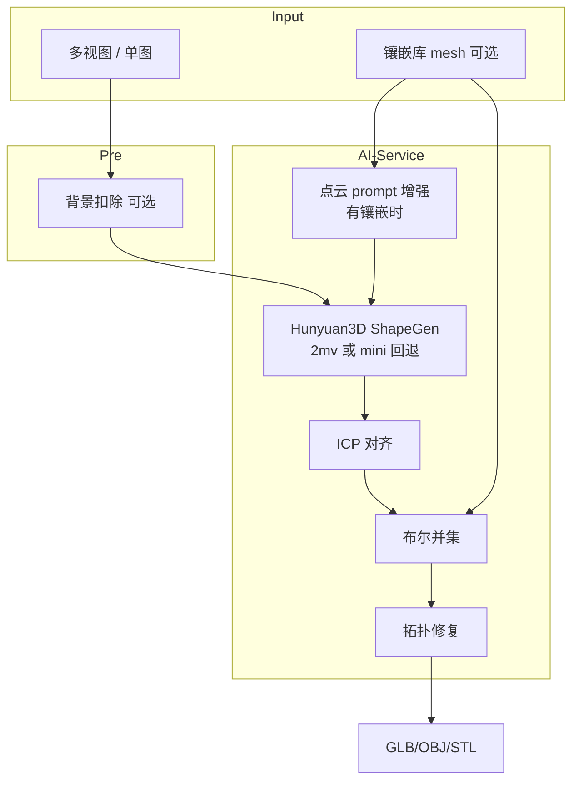
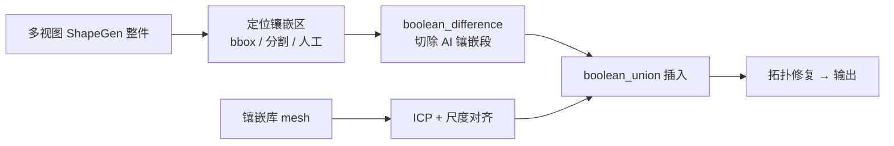

# 轨道 A 开发指南

> 生产轨道：多视图/设计图 + 镶嵌结构库 → 纯几何 3D 建模 → 底座融合 → 输出 GLB/OBJ/STL  
> 轨道 B（Omni 原生条件、LoRA 微调）见 `docs/方案选取.md`，不在本文范围。

---

## 一、轨道 A 目标

### 一期（当前）：条件生成 + 后处理融合

**输入**

- 设计图：单图，或多视图（front/back/left/right，至少 2 张；top/bottom 可存档暂不参与生成）
- 镶嵌结构（可选）：从 `镶嵌结构数据库` 选择，需 OBJ/GLB/STL 或 `.jcd` 同目录伴生 mesh

**处理**

1. （可选）建模前背景扣除 / 多视图逐面抠图  
2. Hunyuan3D ShapeGen 生成**珠宝主体**白模（默认**不烘焙纹理**）  
3. 若选了镶嵌结构：点云条件增强 prompt → ICP 对齐 → 与库中镶嵌 mesh **布尔并集** → 拓扑修复  
4. 输出可下载的几何模型

**设计原则**

- 镶嵌段（约 10–20% 体积）来自**标准库 mesh**，保证工业精度  
- AI 负责生成与之衔接的**主体**（约 80–90%），通过 prompt 约束避免重复生成爪位/镶口  
- **不涉及纹理**（`TRACK_A_GEOMETRY_ONLY=true` 为默认）

### 二期增强：局部替换（规划中）

在一期并集方案出现「AI 主体与底座重叠 / 接缝不良」时启用，详见 [§五、二期增强方案](#五二期增强方案局部替换)。

---

## 二、统一 API（推荐）

| 接口 | 用途 |
|------|------|
| `POST /api/generate/image-to-3d` | **轨道 A 主入口**：单图或多视图 + 可选 `inlay_structure_filename` |
| `POST /api/generate/condition-generate` | 兼容旧调用；内部归一化为 `image-to-3d` 同一管线 |

前端 `HomeView` 已统一走 `image-to-3d`，**多视图与镶嵌可同时启用**。

---

## 三、架构与数据流



---

## 四、环境与启动

### 4.1 模型

| 场景 | 环境变量 | 说明 |
|------|----------|------|
| 开发/低显存 | `MODEL_VERSION=mini` | 单图；多视图会回退 front |
| **推荐生产** | `MODEL_VERSION=mv` | 需下载 `tencent/Hunyuan3D-2mv` |
| 纯几何 | `TRACK_A_GEOMETRY_ONLY=true` | 默认 true，不调用 Paint |

```powershell
# 下载 mini（约 2.7GB，低显存备用）
python scripts/download-models.py --model hunyuan3d-2mini --mirror https://hf-mirror.com

# 下载 2mv 多视图（约 4.6GB，轨道 A 推荐，已配置 MODEL_VERSION=mv）
python scripts/download-2mv.py
```

### 4.2 启动三服务

```powershell
cd D:\Hui_Loading\moje_company\3d_aigc_project
scripts\start-dev.bat
```

或手动设置 AI 环境：

```powershell
cd ai-service
set INLAY_DB_PATH=../镶嵌结构数据库
set MODEL_PATH=../models
set OFFLINE_MODE=true
set MODEL_VERSION=mv
set TRACK_A_GEOMETRY_ONLY=true
python -m app.main
```

访问：http://localhost:8853

---

## 五、二期增强方案（局部替换）

### 5.1 动机

| 问题 | 一期并集 | 二期替换 |
|------|----------|----------|
| AI 重复生成镶嵌区 | 易出现双层几何 | 先切再换，库结构 100% 保留 |
| 主体形态 | 依赖 prompt 约束 | AI 可先建整体再替换 ~10–20% |
| 实现成本 | 低（已落地） | 中高（需差集 + 区域定位） |

### 5.2 目标流程



### 5.3 计划模块（未实现）

| 模块 | 路径（规划） | 说明 |
|------|--------------|------|
| 镶嵌区检测 v1 | `ai-service/.../inlay_region.py` | 底座 bbox + 接触面启发式 |
| 布尔差集 | `mesh_processor.boolean_difference` | 依赖 manifold3d |
| 替换编排 | `InlayReplacementService` | difference → align → union |
| 离线脚本 | `scripts/replace_inlay_structure.py` | 批量验证 |

### 5.4 与一期的关系

- **默认仍用一期并集**，稳定、已实现  
- 任务参数预留 `fusion_mode: union | replace`（二期）  
- 二期可在并集前增加 `difference` 去重，作为混合方案

---

## 六、已实现模块

| 模块 | 路径 |
|------|------|
| 点云条件器 | `ai-service/app/services/pointcloud_conditioner.py` |
| 轨道 A 统一管线 | `ai-service/app/services/generator.py` → `_process_image_to_3d` |
| 多视图 / 2mv 检测 | `ai-service/app/services/multi_view.py` |
| 网格后处理 | `ai-service/app/services/mesh_processor.py` |
| 镶嵌库 API | `business-service/.../InlayStructureService.java` |
| 前端 | `frontend/` MultiViewUploader + InlaySelector |

---

## 七、验收清单

### 一期

- [ ] `GET /health` → `model_loaded=true`
- [ ] `GET /api/inlay/list` 返回镶嵌列表
- [ ] 单图 → 生成并可下载（无纹理白模）
- [ ] 多视图（≥2 面）→ 提交成功；有 2mv 时为真多视图，否则回退单图并有日志
- [ ] **多视图 + 选择镶嵌结构** → 同一任务完成融合输出
- [ ] 镶嵌 `.jcd` 有伴生 OBJ/GLB/STL 时可解析

### 二期（待开发）

- [ ] `boolean_difference` 可用  
- [ ] `fusion_mode=replace` 端到端验收  
- [ ] 多镶口 / 复杂件样例通过  

---

## 八、当前阶段能力说明（重要）

**能否满足「多视图 + 镶嵌结构输入 → 建模结果输出」？**

| 能力 | 状态 |
|------|------|
| API/前端同时接收多视图 + 镶嵌 | ✅ **已满足**（统一 `image-to-3d`） |
| 镶嵌 mesh 参与融合输出 | ✅ **已满足**（ICP + 布尔并集） |
| 纯几何输出（无纹理） | ✅ **已满足**（默认 `TRACK_A_GEOMETRY_ONLY`） |
| **真·多视图 ShapeGen** | ⚠️ **依赖模型**：需本地 `Hunyuan3D-2mv` + `MODEL_VERSION=mv`；仅 mini 时回退正视图单图 |
| 镶嵌库 `.jcd` 无伴生 mesh | ⚠️ 需先运行 `scripts/convert_jcd_to_mesh.py` 生成伴生 OBJ |
| 二期局部替换 | ❌ 未实现，仍为一期并集语义 |

**结论**：轨道 A **一期在链路层面已支持「多视图 + 镶嵌 → 几何输出」**；**几何质量**取决于是否部署 2mv，以及镶嵌文件是否有可用 mesh、AI 主体是否与底座良好衔接（重叠/缝隙风险见二期方案）。

---

## 九、镶嵌文件说明

库内大量 `.jcd` 为 JewelCAD/Matrix **参数化**格式，无法直接被混元 3D 融合。生成时会查找同目录同名 `.obj/.glb/.stl`；若无伴生 mesh 会报错。

### JCD → 伴生 OBJ（批量转换）

```bat
scripts\convert-claw-jcd.bat
:: 或指定子目录 / 全库
python scripts\convert_jcd_to_mesh.py --subdir 爪
python scripts\convert_jcd_to_mesh.py          # 全库
```

- **小 JCD**（≤50KB）：按文件名主石直径生成四爪镶 proxy mesh（mm）
- **大 JCD**：点云提取 + Open3D Poisson 重建
- **归档**：原 `.jcd` 复制到同目录 `_jcd_archive/`（原位保留，前端 catalog id 不变）
- **输出**：同名 `.obj`，业务层 `resolveInlayMeshPath` 自动选用

转换后若业务服务已在运行，建议重启以刷新镶嵌库缓存。预览图见 `scripts/generate_jcd_previews.py`。

---

## 十、后续（轨道 B，非轨道 A）

- Hunyuan3D-Omni 原生点云/bbox 条件注入（替代 prompt 增强）  
- 珠宝 LoRA 微调  
- 智能路由 / 数据飞轮（见 `docs/方案选取.md`）
