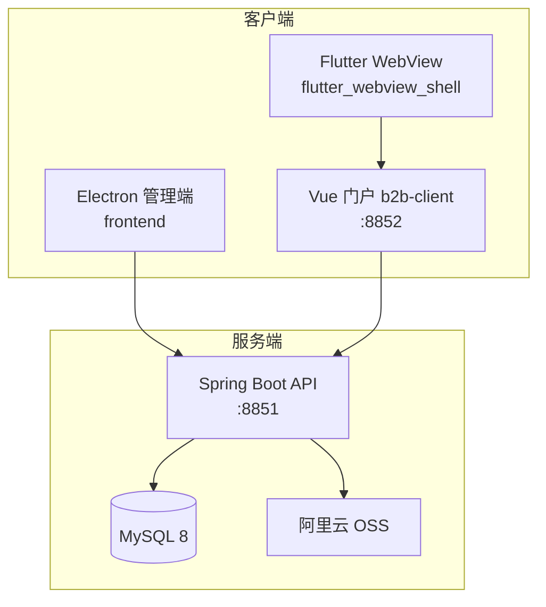

# 珠宝定制管理系统（MOJE）

企业珠宝定制业务的一体化信息化平台：覆盖**订单全生命周期**、**设计 / 建模 / 工艺评审**、**B2B 与 C 端客户门户**、**阿里云 OSS 附件**、**企业微信客户群**等能力。本仓库包含后端 API、Electron 管理端、Vue 统一门户（8852）、Flutter WebView 壳与自动化部署流水线。

---

## 目录

- [系统架构](#系统架构)
- [仓库结构](#仓库结构)
- [技术栈](#技术栈)
- [环境要求](#环境要求)
- [快速开始（本地开发）](#快速开始本地开发)
- [服务与端口](#服务与端口)
- [配置与密钥](#配置与密钥)
- [数据库与迁移（Flyway）](#数据库与迁移flyway)
- [构建说明](#构建说明)
- [CI/CD 与生产部署](#cicd-与生产部署)
- [文档索引](#文档索引)
- [常见问题](#常见问题)

---

## 系统架构



- **管理端（Electron）**：员工日常录单、跟单、设计、建模、归档、统计等。  
- **统一门户（Vue，`b2b-client`）**：B 端客户与 C 端定制进度共用 **8852** 端口（详见 `docs/8852统一客户进度门户.md`）。  
- **Flutter**：可选的 WebView 壳，加载门户或管理端 Web 地址（见 `flutter_webview_shell/README.md`）。

---

## 仓库结构

| 路径 | 说明 |
|------|------|
| `backend/` | Spring Boot 3 + JPA + Flyway + JWT；REST API、Swagger |
| `frontend/` | Electron + React + TypeScript + Ant Design；Webpack 打包 |
| `b2b-client/` | Vue 3 + TypeScript + Ant Design Vue；客户门户与进度页 |
| `flutter_webview_shell/` | Flutter 移动端壳工程 |
| `docs/` | 功能设计、部署、环境变量、门户方案等文档 |
| `.github/workflows/` | GitHub Actions：`deploy.yml` 构建镜像并 SSH 部署等 |
| `docker-compose.dev.yml` | 本地一键起 MySQL + 后端 + 门户（需 `.env`） |
| `.env.example` | 环境变量模板（复制为 `.env` 后填写） |

---

## 技术栈

| 层级 | 技术 |
|------|------|
| 后端 | Java 17、Spring Boot 3、Spring Security、JWT、JPA/Hibernate、Flyway、MySQL 8 |
| 管理端 | Electron、React 18、TypeScript、Ant Design、Zustand、React Router |
| 门户 | Vue 3、TypeScript、Vue Router、Ant Design Vue |
| 移动端壳 | Flutter |
| 存储 | 阿里云 OSS（附件上传，对象键规范见业务代码 `OrderFileService`） |
| 构建 | Maven（后端）、Webpack（Electron 前后端资源）、Vite/npm（`b2b-client`） |
| 部署 | Docker、Docker Compose、GitHub Container Registry、GitHub Actions |

---

## 环境要求

- **Node.js** 18+（前端 / 门户）
- **JDK 17** + **Maven 3.8+**（后端；CI 使用 Temurin 17）
- **Docker** + **Docker Compose**（推荐本地全栈联调）
- **MySQL 8**（本地可用 Compose 拉起）

---

## 快速开始（本地开发）

### 1. 准备环境变量

```bash
cp .env.example .env
# Linux/macOS 亦可：./scripts/init-env.sh
```

编辑 `.env`，至少填写：`DB_PASSWORD`、`JWT_SECRET`、`DEFAULT_ADMIN_PASSWORD`。说明见 **[环境变量清单](docs/环境变量清单.md)**。

### 2. 使用 Docker Compose 启动（推荐）

```bash
docker compose --env-file .env -f docker-compose.dev.yml up -d --build
```

待容器健康后：

- API：`http://localhost:8851/api`（Swagger 见后端 README）
- 门户：`http://localhost:8852`

### 3. 仅开发 Electron 管理端

```bash
cd frontend
npm install
npm run dev
```

需本机或 Compose 已启动后端，并在 Electron 环境配置 **`JEWELRY_API_ORIGIN`** 或 preload 注入的 `API_URL`（与 `docs/环境变量清单.md` 第四节一致）。

### 4. 仅开发门户 `b2b-client`

```bash
cd b2b-client
npm install
npm run dev
```

---

## 服务与端口

| 服务 | 默认端口 | 说明 |
|------|-----------|------|
| Spring Boot API | **8851** | `context-path` 一般为 `/api`；健康检查 `/api/actuator/health` |
| Vue 门户（B2B/C） | **8852** | Nginx 静态站点 + 前端路由 |
| MySQL（dev compose） | **3306** | 仅开发映射到宿主机 |

生产环境端口以服务器与 Compose 为准；GitHub Actions 内置的生产 Compose 与仓库中 `deploy.yml` 描述一致。

---

## 配置与密钥

- **禁止**将真实密码、AccessKey、`JWT_SECRET` 提交到 Git。  
- 统一从 **`.env`**（本地）、**服务器环境变量** 或 **GitHub Actions Secrets** 注入。  
- 完整变量表、脚本与轮换说明： **[docs/环境变量清单.md](docs/环境变量清单.md)**。

---

## 数据库与迁移（Flyway）

- 脚本目录：`backend/src/main/resources/db/migration/`（`V1__*.sql` 起版本递增）。  
- **本地**：后端启动时自动迁移；亦可用 `mvn -f backend/pom.xml flyway:migrate`（需导出 `DB_PASSWORD` 等，见环境变量文档）。  
- **生产**：新镜像启动时由 Spring Boot 执行 Flyway；部署流水线在健康检查通过后会打印 `flyway_schema_history` 最近记录便于核对（见 `.github/workflows/deploy.yml`）。

---

## 构建说明

### 后端

```bash
cd backend
mvn clean package -DskipTests
```

### Electron 前端（生产资源）

```bash
cd frontend
npm install
npm run build
```

### 门户

```bash
cd b2b-client
npm install
npm run build
```

### Flutter（可选）

参见 **`flutter_webview_shell/README.md`** 与 `.github/workflows/flutter-webview-build.yml`。

---

## CI/CD 与生产部署

### 触发条件

- 向 **`main`** 分支 **push** 会触发工作流 **[`.github/workflows/deploy.yml`](.github/workflows/deploy.yml)**：
  - **build-and-push**：Maven 构建后端、构建并推送 **GHCR** 镜像（后端 + `b2b-client`）。
  - **deploy-to-server**：在配置好 SSH 与 `DB_PASSWORD`、`JWT_SECRET`、`DEFAULT_ADMIN_PASSWORD` 等 Secrets 时，通过 SSH 在目标机执行 `docker compose pull && up`，完成滚动更新。

### 合并到 `main` 即部署

将已通过评审的提交 **合并并推送至 `main`**，即可自动触发上述流水线（无需额外打 Tag，除非你们另有发布规范）。

### 详细说明

- [GitHub Actions SSH 部署配置指南](docs/GitHub%20Actions%20SSH部署配置指南.md)  
- [GitHub Actions 配置检查清单](docs/GitHub%20Actions配置检查清单.md)  
- [珠宝定制系统部署实施指南](docs/珠宝定制系统部署实施指南.md)  

---

## 文档索引

| 文档 | 内容 |
|------|------|
| [环境变量清单](docs/环境变量清单.md) | 各组件环境变量与 Secrets |
| [8852 统一客户进度门户](docs/8852统一客户进度门户.md) | B/C 端共用门户与路由说明 |
| [功能设计文档](docs/珠宝定制工作室企业信息化管理系统功能设计文档.md) | 业务与权限设计 |
| `backend/README.md` | 后端模块、API 入口、开发说明 |

---

## 常见问题

**1. Electron 卡在「正在加载珠宝定制管理系统…」**  
渲染 bundle 在 `DOMContentLoaded` 之后执行会导致旧版未派发 `app-loaded`。当前已在 `frontend/src/renderer/index.tsx` 与 `index.html` 做多重兜底；请使用 **最新 `main` 构建的安装包**。

**2. 部署报 `JWT_SECRET` / `DB_PASSWORD` 为空**  
在 GitHub 仓库 **Settings → Secrets and variables → Actions** 中补齐，与 `deploy.yml` 校验逻辑一致。

**3. OSS 上传失败**  
检查 `OSS_*` 与 `ALIYUN_OSS_ENDPOINT`；开发环境可不配 OSS（部分功能会受限）。

**4. 本地数据库连接失败**  
确认 Compose 中 MySQL 已 healthy，且后端 `DB_HOST`/`DB_PORT` 与运行环境一致（容器内一般为 `mysql:3306`）。

---

## 许可证与归属

本仓库为 **企业内部 / 客户项目** 用途时，著作权与许可以合同约定为准；未声明开源许可证前，**请勿**将含业务与密钥配置的副本对外公开传播。

---

*最后更新：文档随仓库演进维护；部署行为以 `.github/workflows` 与 `docs/` 中最新说明为准。*
