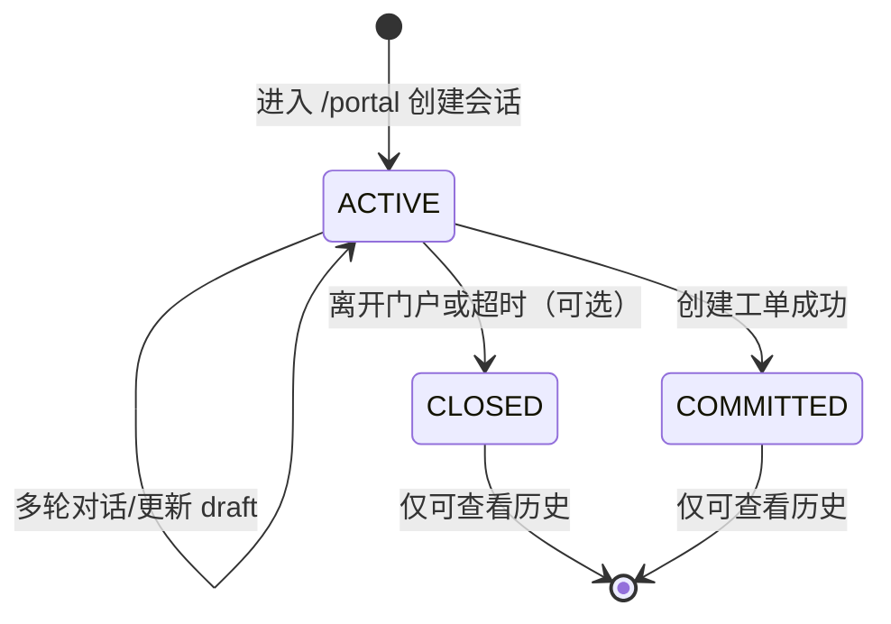

# B2B 门户 Agent 引导录入功能设计

## 1. 背景与目标

B 端客户通过 `/portal` 进入门户后，默认进入 **Agent 智能引导** 对话界面，以自然语言 + 图片方式完成「新建建模订单」信息采集，降低表单填写门槛。对话过程数据实时持久化；信息齐全后展示订单确认卡片，经二次确认后创建正式工单，并返回进度链接、订单二维码及企业微信引导。

技术约束：

- 大模型调用使用管理员在「系统配置 → 销售助手集成」中配置的 **通义千问（DashScope）API Key** 与模型名。
- 参考图上传至 **阿里云 OSS**（与现有订单附件一致）。
- 每次进入 `/portal` **开启新会话**；历史会话可查看记录，**不可继续发消息**。

## 2. 用户角色与入口

| 角色 | 行为 |
|------|------|
| 未登录 B 端客户 | 进入 `/portal` 见 Agent；气泡引导登录/注册；可浏览欢迎语，提交图片/文字前需登录（或点击快捷按钮唤起登录弹窗） |
| 已登录 B 端客户 | Agent 以联系人/公司名打招呼；聊天框上方展示「查看我的订单进度」快捷按钮 |
| 管理员 | 系统配置中上传/更新 B 端客服 **企业微信二维码**；未配置时 Agent 降级文案：「客服将在 24h 内与您取得联系」 |

## 3. 页面与交互

### 3.1 门户布局（`/portal`）

```
┌─────────────────────────────────────────────┐
│ MOJE 门户 Header（返回首页 / 我的订单 / 退出）│
├─────────────────────────────────────────────┤
│ [查看我的订单进度]  （仅登录后显示）           │
├─────────────────────────────────────────────┤
│  对话消息区（用户 / Agent）                   │
│  - 支持文本、图片消息                         │
│  - 订单确认卡片（draft 汇总）                 │
├─────────────────────────────────────────────┤
│  输入框 + 上传图片 + 发送                      │
└─────────────────────────────────────────────┘
│ 侧栏/抽屉：历史会话列表（只读）               │
```

- **传统表单**：保留于 `/portal/form`（原 Portal 多 Tab 表单），供习惯手工填写的客户使用。
- **登录弹窗**：未登录时点击快捷操作、发送消息或上传图片 → 弹出登录/注册 Tab（复用现有 B2B 认证 API）。

### 3.2 对话状态机



- `ACTIVE`：可发送消息。
- `CLOSED`：用户新开对话后，旧会话自动 `CLOSED`。
- `COMMITTED`：已从该会话创建订单。

### 3.3 Agent 业务流程

1. **欢迎**：未登录 → 引导登录；已登录 → 个性化问候 + 说明可上传参考图描述需求。
2. **收图**：用户上传珠宝参考图 → OSS → 视觉模型识别品类（戒指/项链/耳饰等）及可见字段 → 写入 `draft`。
3. **补全**：文本模型根据 `draft` 与对话历史，追问缺失项（基础需求、款式、材质、公司/联系人等）。
4. **变更识别**：用户更换图片或修改描述 → 更新 `draft` 并回复确认已更新。
5. **确认卡片**：`draft` 满足必填规则后，Agent 推送 **订单卡片**（全字段只读展示）。
6. **创建工单**：用户点击卡片「创建工单」→ 二次确认弹窗 → `POST commit` → 调用现有 `B2BOrderService.createOrder` + 关联参考图 → 返回 `B2BOrderAccessDto`（链接 + 二维码）。
7. **收尾**：展示进度链接、订单二维码；若有管理员配置的企微客服码则发送图片消息，否则降级 24h 联系文案。

### 3.4 订单 Draft 字段（与 B2B 创建订单对齐）

| 字段 | 说明 | 必填 |
|------|------|------|
| basicRequirements | 基础需求 | 是 |
| styleInfo | 款式/品名 | 建议 |
| materialInfo | 材质 | 建议 |
| jewelryType | 识别品类（枚举/中文） | 否 |
| companyName / contactPerson | 客户补充信息 | 否 |
| referenceImageUrls | OSS 参考图 URL 列表 | 建议至少 1 张 |
| depositAmount / sourceDetail | 扩展 | 否 |

必填规则：`basicRequirements` 非空；建议至少一张参考图（可由 Agent 提示补传）。

## 4. 接口设计（REST）

前缀：`/b2b/agent`，B2B JWT 与 **会话 publicToken**（请求头 `X-B2B-Agent-Session-Token`）组合鉴权。

| 方法 | 路径 | 说明 | 鉴权 |
|------|------|------|------|
| POST | `/sessions` | 创建新会话（关闭该客户其它 ACTIVE） | 可选登录；返回 `sessionId` + `publicToken` |
| GET | `/sessions/{id}` | 会话详情 + 消息列表 + draft | publicToken 或 B2B JWT |
| GET | `/sessions` | 当前客户历史会话摘要 | B2B JWT |
| POST | `/sessions/{id}/messages` | 发送文本/图片（multipart） | publicToken 或 B2B JWT；未登录禁止 commit |
| POST | `/sessions/{id}/bind` | 登录后会话绑定 clientId | B2B JWT |
| POST | `/sessions/{id}/commit` | 确认创建工单 | B2B JWT |
| GET | `/public/support-wecom` | 客服企微二维码 URL | 公开 |

消息响应体包含：

- `assistantMessage`：Agent 回复文本
- `draft`：当前草稿 JSON
- `uiHints`：`{ needLogin, showConfirmCard, orderResult? }`
- `messages`：更新后的消息列表（可选）

## 5. 数据模型

### 5.1 表 `b2b_agent_session`

| 列 | 类型 | 说明 |
|----|------|------|
| id | BIGINT PK | |
| public_token | VARCHAR(64) UNIQUE | 匿名访问凭证 |
| client_id | BIGINT NULL | B2B 客户 ID |
| status | VARCHAR(20) | ACTIVE / CLOSED / COMMITTED |
| draft_json | JSON | 订单草稿 |
| committed_order_id | BIGINT NULL | 已创建订单 |
| created_at / updated_at | TIMESTAMP | |

### 5.2 表 `b2b_agent_message`

| 列 | 类型 | 说明 |
|----|------|------|
| id | BIGINT PK | |
| session_id | BIGINT FK | |
| role | VARCHAR(20) | user / assistant / system |
| content | TEXT | 文本 |
| payload_json | JSON | 图片 URL、卡片、二维码等 |
| created_at | TIMESTAMP | |

### 5.3 配置项 `portal.b2b.supportWecomQrUrl`

管理员上传二维码图片后写入 OSS，URL 存入 `sys_config`。

## 6. AI 调用

| 场景 | 模型 | 说明 |
|------|------|------|
| 聊天推理、字段抽取、变更识别 | `integration.dashscope.chatModel`（默认 `qwen-plus`） | OpenAI 兼容 `chat/completions` |
| 参考图识别 | `integration.dashscope.vlModel`（现有 `qwen-vl-plus`） | 与售前识图一致 |

System Prompt 要点：输出业务回复；必要时附带 ```json``` 块更新 `draft`（`patch` 字段）；识别「换图」「改需求」意图；信息齐全时设置 `readyForConfirm=true`。

## 7. 安全与限制

- 图片大小 ≤ 8MB；类型 jpg/png/webp。
- ACTIVE 会话才允许 `POST messages`。
- `commit` 必须已登录且会话属于当前 `client_id`。
- 速率：单会话每分钟消息数上限（可配置，默认 20）。

## 8. 与现有能力关系

- 工单创建：复用 `B2BOrderService.createOrder`、`OrderFileService.uploadDesignFileForGuest`。
- 进度链接 / 订单二维码：复用 `OrderAccessLinkService.createLink` 返回的 `B2BOrderAccessDto`。
- 订单 PDF 导出（管理端）：由原 Markdown 改为 HTML 工单转 PDF（中文字体嵌入），见 `OrderPdfExportService`。

## 9. 实施分期

| 阶段 | 内容 |
|------|------|
| V1（本期） | 会话/消息表、Agent API、门户 Chat UI、企微码配置、PDF 导出 |
| V2 | 流式输出、会话超时自动 CLOSED、更细品类工艺字段入 draft |

## 10. 验收标准

1. 进入 `/portal` 默认打开 Agent，未登录可看到登录引导。
2. 登录后上传参考图，能识别并写入 draft，多轮补全后能展示确认卡片。
3. 二次确认后创建 B2B 订单，返回可访问链接与二维码。
4. 再次进入 `/portal` 为新会话；旧会话在历史中只读。
5. 管理端可配置企微二维码；未配置时显示 24h 降级文案。
6. 管理端订单详情可导出 PDF 中文工单无乱码。
